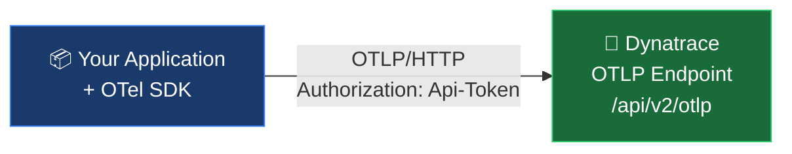
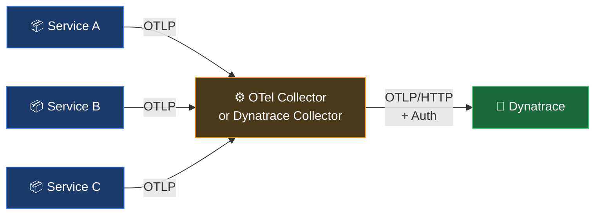

# OpenTelemetry with Dynatrace — Developer Guide

A practical, real-example guide for instrumenting applications with OpenTelemetry and sending telemetry to Dynatrace.

---

## Table of Contents

1. [What is OpenTelemetry?](#what-is-opentelemetry)
2. [Core Concepts](#core-concepts)
3. [Architecture: How Data Flows to Dynatrace](#architecture-how-data-flows-to-dynatrace)
4. [Dynatrace OTLP Setup](#dynatrace-otlp-setup)
   - [Endpoints](#endpoints)
   - [API Token Scopes](#api-token-scopes)
   - [Protocol](#protocol)
5. [Auto-Instrumentation](#auto-instrumentation)
   - [Java](#java)
   - [Python](#python)
   - [Node.js](#nodejs)
   - [Go](#go)
6. [Manual Instrumentation](#manual-instrumentation)
   - [Custom Spans (Traces)](#custom-spans-traces)
   - [Custom Metrics](#custom-metrics)
   - [Logs with Context](#logs-with-context)
7. [Resource Attributes](#resource-attributes)
8. [The Collector Pattern](#the-collector-pattern)
9. [Common Patterns & Recipes](#common-patterns--recipes)
10. [Tips](#tips)

---

## What is OpenTelemetry?

OpenTelemetry (OTel) is a vendor-neutral, CNCF standard for collecting **traces**, **metrics**, and **logs** from your applications and infrastructure. It provides SDKs, APIs, and a wire protocol (OTLP) that let you instrument once and send to any backend — including Dynatrace.

Dynatrace ingests OTel data natively via its OTLP endpoint. This means you can instrument your app with the standard OTel SDK and ship telemetry directly to Dynatrace without any proprietary agent.

---

## Core Concepts

| Term | What it is |
|------|-----------|
| **Signal** | A type of telemetry data: traces, metrics, or logs |
| **Span** | A single unit of work within a trace — has a name, timestamps, attributes, and status |
| **Trace** | A collection of spans forming an end-to-end request path across services |
| **Metric** | A numeric measurement over time: counters, gauges, histograms |
| **Log** | A timestamped record of an event — enriched with trace context when correlated |
| **Resource** | Attributes describing the entity producing telemetry (e.g. `service.name`, `host.name`) |
| **OTLP** | OpenTelemetry Protocol — the wire format used to export data to a backend |
| **Exporter** | The SDK component that serializes and sends telemetry to a backend endpoint |
| **Instrumentation Library** | A library that automatically generates spans for a framework (e.g. Express, Django, Spring) |
| **Collector** | A standalone agent/proxy that receives, processes, and re-exports telemetry |

---

## Architecture: How Data Flows to Dynatrace

### Option 1 — Direct export (simple, recommended for getting started)



Your app's OTel SDK exports traces, metrics, and logs directly to Dynatrace. No intermediate component needed.

---

### Option 2 — Via Collector (recommended for production)



Services export to a local Collector (no auth needed from app). The Collector handles batching, retry, and auth toward Dynatrace. This is better for production — apps don't need to carry tokens.

---

## Dynatrace OTLP Setup

### Endpoints

#### SaaS

| Signal | Endpoint |
|--------|----------|
| Base (all signals) | `https://{environment-id}.live.dynatrace.com/api/v2/otlp` |
| Traces | `https://{environment-id}.live.dynatrace.com/api/v2/otlp/v1/traces` |
| Metrics | `https://{environment-id}.live.dynatrace.com/api/v2/otlp/v1/metrics` |
| Logs | `https://{environment-id}.live.dynatrace.com/api/v2/otlp/v1/logs` |

#### Managed (via Environment ActiveGate)

| Signal | Endpoint |
|--------|----------|
| Base | `https://{activegate-domain}:9999/e/{environment-id}/api/v2/otlp` |
| Traces | `https://{activegate-domain}:9999/e/{environment-id}/api/v2/otlp/v1/traces` |
| Metrics | `https://{activegate-domain}:9999/e/{environment-id}/api/v2/otlp/v1/metrics` |
| Logs | `https://{activegate-domain}:9999/e/{environment-id}/api/v2/otlp/v1/logs` |

> **Tip:** Set `OTEL_EXPORTER_OTLP_ENDPOINT` to the **base** URL (`/api/v2/otlp`). The SDK automatically appends `/v1/traces`, `/v1/metrics`, `/v1/logs` per signal.

---

### API Token Scopes

Create your API token at **Settings > Access Tokens > Generate new token**. Required scopes depend on which signals you send:

| Signal | Required Token Scope |
|--------|---------------------|
| Traces | `openTelemetryTrace.ingest` |
| Metrics | `metrics.ingest` |
| Logs | `logs.ingest` |

You can combine all three scopes on a single token.

---

### Protocol

Dynatrace supports **OTLP/HTTP only**. gRPC is **not** supported.

Always set:
```bash
OTEL_EXPORTER_OTLP_PROTOCOL=http/protobuf
```

The full environment variable configuration pattern:

```bash
OTEL_EXPORTER_OTLP_ENDPOINT="https://{environment-id}.live.dynatrace.com/api/v2/otlp"
OTEL_EXPORTER_OTLP_HEADERS="Authorization=Api-Token {your-token}"
OTEL_EXPORTER_OTLP_PROTOCOL="http/protobuf"
OTEL_RESOURCE_ATTRIBUTES="service.name=my-service,service.version=1.0.0"
```

> `service.name` is **required** — without it, Dynatrace cannot properly detect and create the service entity.

---

## Auto-Instrumentation

Auto-instrumentation generates spans for web frameworks, HTTP clients, database calls, and more — with no code changes. You configure the SDK once at startup.

---

### Java

Auto-instrumentation uses the OpenTelemetry Java agent. It instruments Spring Boot, Quarkus, Micronaut, JDBC, HTTP clients, and [many more](https://github.com/open-telemetry/opentelemetry-java-instrumentation/blob/main/docs/supported-libraries.md) automatically.

**Step 1 — Download the agent:**

```bash
curl -L -O https://github.com/open-telemetry/opentelemetry-java-instrumentation/releases/latest/download/opentelemetry-javaagent.jar
```

**Step 2 — Run your app with the agent:**

```bash
export JAVA_TOOL_OPTIONS="-javaagent:/path/to/opentelemetry-javaagent.jar"
export OTEL_SERVICE_NAME="checkout-service"
export OTEL_RESOURCE_ATTRIBUTES="service.version=2.1.0,deployment.environment=production"
export OTEL_EXPORTER_OTLP_ENDPOINT="https://{environment-id}.live.dynatrace.com/api/v2/otlp"
export OTEL_EXPORTER_OTLP_HEADERS="Authorization=Api-Token {your-token}"
export OTEL_EXPORTER_OTLP_PROTOCOL="http/protobuf"

java -jar my-app.jar
```

**What gets instrumented automatically:**
- Spring MVC, Spring Boot, Spring WebFlux
- Servlet containers (Tomcat, Jetty, Undertow)
- JDBC (all major drivers)
- gRPC, Feign, OkHttp, Apache HttpClient
- Kafka, RabbitMQ, JMS

**Verify it's working** — run with console exporter first:

```bash
export OTEL_TRACES_EXPORTER=logging
export OTEL_METRICS_EXPORTER=logging
export OTEL_LOGS_EXPORTER=logging
java -jar my-app.jar
```

You'll see spans printed to stdout before wiring up the Dynatrace endpoint.

---

### Python

Python auto-instrumentation uses the `opentelemetry-instrument` launcher. It monkey-patches Flask, Django, FastAPI, SQLAlchemy, requests, and more.

**Step 1 — Install the distro and bootstrap:**

```bash
pip install opentelemetry-distro opentelemetry-exporter-otlp
opentelemetry-bootstrap -a install   # auto-detects installed packages and installs their instrumentors
```

**Step 2 — Run your app:**

```bash
opentelemetry-instrument \
  --service_name "inventory-service" \
  python app.py
```

Or with environment variables (recommended for production):

```bash
export OTEL_SERVICE_NAME="inventory-service"
export OTEL_RESOURCE_ATTRIBUTES="service.version=0.4.2,deployment.environment=staging"
export OTEL_EXPORTER_OTLP_ENDPOINT="https://{environment-id}.live.dynatrace.com/api/v2/otlp"
export OTEL_EXPORTER_OTLP_HEADERS="Authorization=Api-Token {your-token}"
export OTEL_EXPORTER_OTLP_PROTOCOL="http/protobuf"

opentelemetry-instrument python app.py
```

**Flask example app** (`app.py`):

```python
from flask import Flask
app = Flask(__name__)

@app.route("/")
def index():
    return "Hello, World!"

if __name__ == "__main__":
    app.run(port=8080)
```

Run it — every HTTP request automatically generates a span with route, method, status code, and duration. No Flask-specific code needed.

**What gets instrumented automatically via `opentelemetry-bootstrap`:**

| Package installed | Instrumentor added |
|-------------------|--------------------|
| `flask` | `opentelemetry-instrumentation-flask` |
| `django` | `opentelemetry-instrumentation-django` |
| `fastapi` | `opentelemetry-instrumentation-fastapi` |
| `sqlalchemy` | `opentelemetry-instrumentation-sqlalchemy` |
| `requests` | `opentelemetry-instrumentation-requests` |
| `psycopg2` | `opentelemetry-instrumentation-psycopg2` |

---

### Node.js

Node.js auto-instrumentation uses the `@opentelemetry/auto-instrumentations-node` package, which wraps Express, HTTP, gRPC, pg, MongoDB, Redis, and more.

**Step 1 — Install:**

```bash
npm install \
  @opentelemetry/sdk-node \
  @opentelemetry/api \
  @opentelemetry/auto-instrumentations-node \
  @opentelemetry/exporter-trace-otlp-proto \
  @opentelemetry/exporter-metrics-otlp-proto
```

**Step 2 — Create `instrumentation.js`:**

```javascript
const { NodeSDK } = require('@opentelemetry/sdk-node');
const { getNodeAutoInstrumentations } = require('@opentelemetry/auto-instrumentations-node');
const { OTLPTraceExporter } = require('@opentelemetry/exporter-trace-otlp-proto');
const { OTLPMetricExporter } = require('@opentelemetry/exporter-metrics-otlp-proto');
const { PeriodicExportingMetricReader } = require('@opentelemetry/sdk-metrics');

const sdk = new NodeSDK({
  traceExporter: new OTLPTraceExporter(),   // reads OTEL_EXPORTER_OTLP_* env vars
  metricReader: new PeriodicExportingMetricReader({
    exporter: new OTLPMetricExporter(),
    exportIntervalMillis: 60000,
  }),
  instrumentations: [getNodeAutoInstrumentations()],
});

sdk.start();
```

**Step 3 — Run:**

```bash
export OTEL_SERVICE_NAME="payment-service"
export OTEL_RESOURCE_ATTRIBUTES="service.version=3.0.1,deployment.environment=production"
export OTEL_EXPORTER_OTLP_ENDPOINT="https://{environment-id}.live.dynatrace.com/api/v2/otlp"
export OTEL_EXPORTER_OTLP_HEADERS="Authorization=Api-Token {your-token}"
export OTEL_EXPORTER_OTLP_PROTOCOL="http/protobuf"

node --require ./instrumentation.js app.js
```

Or using ESM:

```bash
node --import ./instrumentation.mjs app.js
```

**Express app example** (`app.js`):

```javascript
const express = require('express');
const app = express();

app.get('/checkout', async (req, res) => {
  // This entire handler is automatically traced as a span
  res.json({ status: 'ok' });
});

app.listen(8080);
```

---

### Go

Go does not support runtime monkey-patching, so auto-instrumentation uses wrapper libraries rather than a zero-code agent. You add a few lines to `main.go` and import instrumented transport/middleware packages.

**Step 1 — Install packages:**

```bash
go get go.opentelemetry.io/otel
go get go.opentelemetry.io/otel/exporters/otlp/otlptrace/otlptracehttp
go get go.opentelemetry.io/otel/exporters/otlp/otlpmetric/otlpmetrichttp
go get go.opentelemetry.io/otel/sdk/trace
go get go.opentelemetry.io/otel/sdk/metric
go get go.opentelemetry.io/contrib/instrumentation/net/http/otelhttp
```

**Step 2 — Initialize the SDK in `main.go`:**

```go
package main

import (
    "context"
    "log"
    "net/http"
    "os"

    "go.opentelemetry.io/contrib/instrumentation/net/http/otelhttp"
    "go.opentelemetry.io/otel"
    "go.opentelemetry.io/otel/exporters/otlp/otlptrace/otlptracehttp"
    "go.opentelemetry.io/otel/sdk/resource"
    sdktrace "go.opentelemetry.io/otel/sdk/trace"
    semconv "go.opentelemetry.io/otel/semconv/v1.26.0"
)

func initTracer(ctx context.Context) func(context.Context) error {
    exporter, err := otlptracehttp.New(ctx) // reads OTEL_EXPORTER_OTLP_* env vars
    if err != nil {
        log.Fatal(err)
    }

    res, _ := resource.New(ctx,
        resource.WithAttributes(
            semconv.ServiceName(os.Getenv("OTEL_SERVICE_NAME")),
        ),
    )

    tp := sdktrace.NewTracerProvider(
        sdktrace.WithBatcher(exporter),
        sdktrace.WithResource(res),
    )
    otel.SetTracerProvider(tp)
    return tp.Shutdown
}

func main() {
    ctx := context.Background()
    shutdown := initTracer(ctx)
    defer shutdown(ctx)

    // Wrap your HTTP handler with otelhttp — every request is automatically traced
    http.Handle("/orders", otelhttp.NewHandler(http.HandlerFunc(ordersHandler), "orders"))
    http.ListenAndServe(":8080", nil)
}

func ordersHandler(w http.ResponseWriter, r *http.Request) {
    w.Write([]byte(`{"status":"ok"}`))
}
```

**Run:**

```bash
export OTEL_SERVICE_NAME="orders-service"
export OTEL_RESOURCE_ATTRIBUTES="service.version=1.2.0"
export OTEL_EXPORTER_OTLP_ENDPOINT="https://{environment-id}.live.dynatrace.com/api/v2/otlp"
export OTEL_EXPORTER_OTLP_HEADERS="Authorization=Api-Token {your-token}"
export OTEL_EXPORTER_OTLP_PROTOCOL="http/protobuf"

go run .
```

---

## Manual Instrumentation

Use manual instrumentation to trace custom business logic, record application-level metrics, or add structured logs correlated to traces. Works in addition to (or instead of) auto-instrumentation.

---

### Custom Spans (Traces)

A span represents one unit of work. Create child spans to trace internal logic within an auto-instrumented request.

#### Python

```python
from opentelemetry import trace

tracer = trace.get_tracer("my-app.tracer")

def process_order(order_id: str):
    with tracer.start_as_current_span("process-order") as span:
        span.set_attribute("order.id", order_id)
        span.set_attribute("order.source", "web")

        result = validate_order(order_id)

        if not result.valid:
            span.set_status(trace.StatusCode.ERROR, result.reason)
            span.record_exception(ValueError(result.reason))
            return

        span.set_attribute("order.item_count", len(result.items))
        charge_customer(order_id, result.total)
```

**Span attributes to set for good Dynatrace UX:**

| Attribute | Example value | What it does in Dynatrace |
|-----------|---------------|--------------------------|
| `db.system` | `postgresql` | Groups under database spans |
| `db.name` | `orders` | Shows DB name in trace |
| `db.statement` | `SELECT * FROM orders WHERE id=?` | Shows query in trace detail |
| `http.method` | `POST` | Shown on HTTP spans |
| `http.url` | `https://api.example.com/checkout` | Links to external calls |
| `http.status_code` | `200` | Used for error detection |
| `messaging.system` | `kafka` | Groups under messaging spans |
| `messaging.destination.name` | `order-events` | Shows topic/queue name |
| `error` | `true` | Marks span as failed in Dynatrace |

#### Node.js

```javascript
const { trace, SpanStatusCode } = require('@opentelemetry/api');

const tracer = trace.getTracer('payment-service');

async function chargeCard(customerId, amount) {
  const span = tracer.startSpan('charge-card');

  try {
    span.setAttributes({
      'customer.id': customerId,
      'payment.amount': amount,
      'payment.currency': 'USD',
    });

    const result = await paymentGateway.charge(customerId, amount);
    span.setAttribute('payment.transaction_id', result.txId);
    return result;

  } catch (err) {
    span.setStatus({ code: SpanStatusCode.ERROR, message: err.message });
    span.recordException(err);
    throw err;
  } finally {
    span.end();
  }
}
```

#### Java

```java
import io.opentelemetry.api.GlobalOpenTelemetry;
import io.opentelemetry.api.trace.Span;
import io.opentelemetry.api.trace.StatusCode;
import io.opentelemetry.api.trace.Tracer;
import io.opentelemetry.context.Scope;

public class OrderService {
    private static final Tracer tracer =
        GlobalOpenTelemetry.getTracer("com.example.order-service");

    public void fulfillOrder(String orderId) {
        Span span = tracer.spanBuilder("fulfill-order")
            .setAttribute("order.id", orderId)
            .startSpan();

        try (Scope scope = span.makeCurrent()) {
            inventoryService.reserve(orderId);
            shippingService.schedule(orderId);
            span.setAttribute("order.status", "fulfilled");

        } catch (Exception e) {
            span.setStatus(StatusCode.ERROR, e.getMessage());
            span.recordException(e);
            throw e;
        } finally {
            span.end();
        }
    }
}
```

---

### Custom Metrics

OTel provides three metric instruments: **Counter**, **Gauge**, and **Histogram**.

| Instrument | Use for | Example |
|------------|---------|---------|
| `Counter` | Things that only go up: requests, errors, events processed | `requests_total` |
| `UpDownCounter` | Things that go up and down: queue depth, active connections | `active_sessions` |
| `Gauge` | A point-in-time value: CPU %, cache hit rate | `cpu_usage` |
| `Histogram` | Distribution of values: latency, payload size | `request_duration_ms` |

#### Python

```python
from opentelemetry import metrics

meter = metrics.get_meter("order-service.meter")

# Counter: total orders placed
orders_counter = meter.create_counter(
    name="orders.placed",
    description="Total number of orders placed",
    unit="1",
)

# Histogram: order processing time in milliseconds
processing_time = meter.create_histogram(
    name="orders.processing_duration",
    description="Time to process an order",
    unit="ms",
)

# UpDownCounter: current items in the checkout queue
queue_depth = meter.create_up_down_counter(
    name="checkout.queue.depth",
    description="Number of orders currently being processed",
)

# Usage
def place_order(order_id, region):
    import time
    start = time.time()

    orders_counter.add(1, {"region": region, "channel": "web"})
    queue_depth.add(1)

    process_order(order_id)

    elapsed_ms = (time.time() - start) * 1000
    processing_time.record(elapsed_ms, {"region": region})
    queue_depth.add(-1)
```

#### Node.js

```javascript
const { metrics } = require('@opentelemetry/api');

const meter = metrics.getMeter('checkout-service');

const checkoutsCounter = meter.createCounter('checkouts.started', {
  description: 'Number of checkout flows initiated',
});

const cartValueHistogram = meter.createHistogram('cart.value', {
  description: 'Value of shopping cart at checkout start',
  unit: 'USD',
});

// Usage in a route handler
app.post('/checkout/start', (req, res) => {
  const { cartTotal, currency } = req.body;

  checkoutsCounter.add(1, { currency, platform: 'web' });
  cartValueHistogram.record(cartTotal, { currency });

  res.json({ checkoutId: generateId() });
});
```

#### Java

```java
import io.opentelemetry.api.GlobalOpenTelemetry;
import io.opentelemetry.api.metrics.LongCounter;
import io.opentelemetry.api.metrics.DoubleHistogram;
import io.opentelemetry.api.metrics.Meter;
import io.opentelemetry.api.common.Attributes;

public class MetricsService {
    private static final Meter meter =
        GlobalOpenTelemetry.getMeter("com.example.checkout");

    private static final LongCounter checkoutsStarted = meter
        .counterBuilder("checkouts.started")
        .setDescription("Checkout flows initiated")
        .setUnit("1")
        .build();

    private static final DoubleHistogram cartValue = meter
        .histogramBuilder("cart.value")
        .setDescription("Cart value at checkout start")
        .setUnit("USD")
        .build();

    public void startCheckout(String currency, double amount) {
        checkoutsStarted.add(1,
            Attributes.builder()
                .put("currency", currency)
                .put("platform", "web")
                .build()
        );
        cartValue.record(amount,
            Attributes.builder().put("currency", currency).build()
        );
    }
}
```

---

### Logs with Context

When OTel SDK is initialized, logs written with standard logging frameworks are automatically correlated to the active trace. This gives you trace-to-log correlation in Dynatrace automatically.

#### Python (structlog / standard logging)

```python
import logging
from opentelemetry.instrumentation.logging import LoggingInstrumentor

# Wire up OTel log correlation (adds trace_id, span_id to log records)
LoggingInstrumentor().instrument(set_logging_format=True)

logger = logging.getLogger("order-service")

def process_payment(order_id: str):
    with tracer.start_as_current_span("process-payment") as span:
        logger.info("Processing payment", extra={"order.id": order_id})
        # Log output will include trace_id and span_id automatically
```

#### Node.js (with `@opentelemetry/winston-transport`)

```javascript
const { createLogger, transports } = require('winston');
const { OpenTelemetryTransportV3 } = require('@opentelemetry/winston-transport');

const logger = createLogger({
  transports: [
    new transports.Console(),
    new OpenTelemetryTransportV3(),   // forwards log records to OTel logs pipeline
  ],
});

// Inside a traced handler, trace_id and span_id are injected automatically
app.get('/order/:id', (req, res) => {
  logger.info('Fetching order', { orderId: req.params.id });
  // ...
});
```

---

## Resource Attributes

Resources describe the entity emitting telemetry. They appear as dimensions in Dynatrace and drive service detection.

### Required and Recommended Attributes

| Attribute | Required? | Example | Purpose |
|-----------|-----------|---------|---------|
| `service.name` | **Required** | `checkout-service` | Service entity creation in Dynatrace |
| `service.version` | Recommended | `2.1.0` | Version tag shown in Dynatrace |
| `service.namespace` | Recommended | `ecommerce` | Groups related services |
| `deployment.environment` | Recommended | `production` | Shown in Dynatrace environment context |
| `host.name` | Auto-detected | `web-server-01` | Links to host entity |
| `k8s.cluster.name` | K8s only | `prod-cluster` | Links to Kubernetes cluster entity |
| `k8s.namespace.name` | K8s only | `payments` | Links to Kubernetes namespace |
| `k8s.pod.name` | K8s only | `checkout-abc123` | Links to Kubernetes pod entity |

### Setting Resource Attributes

**Via environment variables (recommended — works across all languages):**

```bash
OTEL_SERVICE_NAME="checkout-service"
OTEL_RESOURCE_ATTRIBUTES="service.version=2.1.0,service.namespace=ecommerce,deployment.environment=production"
```

`OTEL_SERVICE_NAME` always takes precedence over `service.name` in `OTEL_RESOURCE_ATTRIBUTES`.

**Programmatically (Java example):**

```java
Resource resource = Resource.getDefault().merge(
    Resource.create(Attributes.of(
        ResourceAttributes.SERVICE_NAME, "checkout-service",
        ResourceAttributes.SERVICE_VERSION, "2.1.0",
        ResourceAttributes.DEPLOYMENT_ENVIRONMENT, "production"
    ))
);
```

### Attribute Limits in Dynatrace

| Limit | Value |
|-------|-------|
| Key length | 1–100 characters |
| Value length | 1–255 characters |
| Max dimensions per metric data point | 50 |
| Supported value types | String, Boolean, Integer |
| Unsupported types | Double, Bytes, Array, Map — **dropped on ingest** |

---

## The Collector Pattern

The OpenTelemetry Collector is a standalone service that receives telemetry, processes it, and re-exports it. Dynatrace offers its own distribution called the **Dynatrace Collector** that is pre-configured and supported.

### When to use a Collector

| Scenario | Direct Export | Via Collector |
|----------|--------------|---------------|
| Getting started / dev | ✅ simpler | — |
| Multiple services, single auth point | — | ✅ centralized token management |
| Need to add/remove/transform attributes | — | ✅ processor pipeline |
| Kubernetes deployment | — | ✅ Dynatrace Operator manages it |
| On-premise with DMZ | — | ✅ Collector in DMZ forwards traffic |

### Dynatrace Collector vs OpenTelemetry Collector

| | Dynatrace Collector | OpenTelemetry Collector |
|---|---|---|
| Support | Fully supported by Dynatrace | Community / best-effort from Dynatrace |
| Security patches | Dynatrace-managed, independent of OTel releases | Follow upstream OTel releases |
| Configuration | Single YAML, optimized for Dynatrace | Flexible but more complex |
| Kubernetes | Managed by Dynatrace Operator | Manual deployment |
| Customization | Limited to supported components | Full OTel Contrib component set |
| Use when | Standard Dynatrace deployment | Existing OTel expertise or custom pipelines |

### Collector config example (OTel Collector → Dynatrace)

`collector.yaml`:

```yaml
receivers:
  otlp:
    protocols:
      grpc:
        endpoint: 0.0.0.0:4317      # apps send here over gRPC (no auth needed)
      http:
        endpoint: 0.0.0.0:4318      # apps can also send over HTTP

processors:
  batch:
    timeout: 5s
    send_batch_size: 512
  resource:
    attributes:
      - key: deployment.environment
        value: production
        action: insert             # add env tag to all telemetry passing through

exporters:
  otlphttp:
    endpoint: "https://{environment-id}.live.dynatrace.com/api/v2/otlp"
    headers:
      Authorization: "Api-Token ${DT_API_TOKEN}"

service:
  pipelines:
    traces:
      receivers: [otlp]
      processors: [batch, resource]
      exporters: [otlphttp]
    metrics:
      receivers: [otlp]
      processors: [batch, resource]
      exporters: [otlphttp]
    logs:
      receivers: [otlp]
      processors: [batch, resource]
      exporters: [otlphttp]
```

**App-side config when using a Collector:**

```bash
# No token needed — Collector handles auth
OTEL_EXPORTER_OTLP_ENDPOINT="http://collector:4317"
OTEL_EXPORTER_OTLP_PROTOCOL="grpc"   # can use gRPC to local Collector
OTEL_SERVICE_NAME="checkout-service"
```

---

## Common Patterns & Recipes

---

### Verify connectivity before going to production

Send a test span using `curl` against the Dynatrace OTLP endpoint:

```bash
curl -X POST \
  "https://{environment-id}.live.dynatrace.com/api/v2/otlp/v1/traces" \
  -H "Authorization: Api-Token {your-token}" \
  -H "Content-Type: application/x-protobuf" \
  --data-binary @/dev/null \
  -v
```

A `200 OK` or `400 Bad Request` (malformed payload) both confirm auth is working. A `401` means the token or scopes are wrong.

---

### Add business context to every span in a service (Python)

Use a span processor to inject common attributes automatically:

```python
from opentelemetry.sdk.trace import SpanProcessor

class BusinessContextProcessor(SpanProcessor):
    def on_start(self, span, parent_context=None):
        span.set_attribute("app.region", os.getenv("APP_REGION", "us-east"))
        span.set_attribute("app.team", "platform-engineering")

    def on_end(self, span):
        pass

# Register in SDK setup
from opentelemetry.sdk.trace import TracerProvider
provider = TracerProvider()
provider.add_span_processor(BusinessContextProcessor())
```

---

### Track external API call success rate (Node.js)

```javascript
const successCounter = meter.createCounter('external_api.calls', {
  description: 'Calls to external APIs',
});

async function callExternalApi(apiName, fn) {
  const span = tracer.startSpan(`external-api.${apiName}`);
  try {
    const result = await fn();
    successCounter.add(1, { api: apiName, status: 'success' });
    return result;
  } catch (err) {
    successCounter.add(1, { api: apiName, status: 'error', error_type: err.constructor.name });
    span.setStatus({ code: SpanStatusCode.ERROR, message: err.message });
    throw err;
  } finally {
    span.end();
  }
}

// Usage
const data = await callExternalApi('stripe', () => stripe.charges.create(params));
```

---

### Propagate trace context across async jobs (Python)

When a background job is triggered from a request, carry the trace context so both are linked in Dynatrace:

```python
from opentelemetry import context, propagate

def enqueue_job(task_data: dict):
    # Capture current trace context
    carrier = {}
    propagate.inject(carrier)  # injects traceparent, tracestate headers

    # Store alongside task data (in Redis, DB, queue message, etc.)
    task_data["_otel_context"] = carrier
    queue.push(task_data)

def process_job(task_data: dict):
    # Restore trace context in the worker process
    carrier = task_data.get("_otel_context", {})
    ctx = propagate.extract(carrier)

    with tracer.start_as_current_span("process-job", context=ctx) as span:
        span.set_attribute("job.type", task_data["type"])
        # This span is linked to the original request trace
```

---

### Instrument a database call manually (Java)

When using a driver not covered by auto-instrumentation:

```java
public List<Order> fetchOrders(String customerId) {
    Span span = tracer.spanBuilder("db.orders.fetch")
        .setAttribute("db.system", "postgresql")
        .setAttribute("db.name", "commerce")
        .setAttribute("db.operation", "SELECT")
        .setAttribute("db.sql.table", "orders")
        .startSpan();

    try (Scope scope = span.makeCurrent()) {
        return jdbcTemplate.query(
            "SELECT * FROM orders WHERE customer_id = ?",
            ordersRowMapper,
            customerId
        );
    } catch (Exception e) {
        span.setStatus(StatusCode.ERROR, e.getMessage());
        span.recordException(e);
        throw e;
    } finally {
        span.end();
    }
}
```

---

### K8s deployment: inject OTLP config via ConfigMap

`configmap.yaml`:

```yaml
apiVersion: v1
kind: ConfigMap
metadata:
  name: otel-config
data:
  OTEL_EXPORTER_OTLP_ENDPOINT: "https://{environment-id}.live.dynatrace.com/api/v2/otlp"
  OTEL_EXPORTER_OTLP_PROTOCOL: "http/protobuf"
  OTEL_RESOURCE_ATTRIBUTES: "deployment.environment=production,k8s.cluster.name=prod-cluster"
```

`secret.yaml`:

```yaml
apiVersion: v1
kind: Secret
metadata:
  name: dt-api-token
type: Opaque
stringData:
  DT_API_TOKEN: "your-api-token"   # use sealed secrets or external secrets operator in real deployments
```

`deployment.yaml`:

```yaml
spec:
  containers:
    - name: checkout-service
      envFrom:
        - configMapRef:
            name: otel-config
      env:
        - name: OTEL_SERVICE_NAME
          valueFrom:
            fieldRef:
              fieldPath: metadata.labels['app']
        - name: OTEL_EXPORTER_OTLP_HEADERS
          value: "Authorization=Api-Token $(DT_API_TOKEN)"
        - name: DT_API_TOKEN
          valueFrom:
            secretKeyRef:
              name: dt-api-token
              key: DT_API_TOKEN
        - name: OTEL_RESOURCE_ATTRIBUTES
          value: "service.version=$(IMAGE_TAG),k8s.pod.name=$(POD_NAME),k8s.namespace.name=$(POD_NAMESPACE)"
```

---

## Tips

---

### gRPC does NOT work with Dynatrace — always set the protocol explicitly

The OTel SDK defaults to gRPC (`http://localhost:4317`). Dynatrace only accepts HTTP/protobuf. If you forget to set the protocol, your app will silently fail to export.

Always include:

```bash
OTEL_EXPORTER_OTLP_PROTOCOL=http/protobuf
```

Symptom if missing: no data appears in Dynatrace, no errors in the app (the SDK silently retries in the background).

---

### `service.name` is not optional

Without `service.name`, Dynatrace will ingest your spans but cannot create a Service entity. Traces appear as "unknown service" and won't correlate with anything.

```bash
# Minimum viable configuration for Dynatrace
OTEL_SERVICE_NAME="my-service"                             # required
OTEL_EXPORTER_OTLP_ENDPOINT="https://..."                  # required
OTEL_EXPORTER_OTLP_HEADERS="Authorization=Api-Token ..."   # required
OTEL_EXPORTER_OTLP_PROTOCOL="http/protobuf"                # required
```

---

### Doubles, arrays, and maps are dropped on metric ingest

Dynatrace only stores String, Boolean, and Integer attribute values on metrics. If you set a `float` attribute on a metric data point, the entire attribute is dropped (not the data point).

```python
# This attribute will be dropped by Dynatrace
histogram.record(123.4, {"response_time_ms": 45.6})     # float — dropped

# Use integer or string instead
histogram.record(123, {"response_time_ms": "45"})        # string — kept
histogram.record(123, {"response_time_bucket": "50ms"})  # string — kept
```

---

### Keep attribute cardinality low

High-cardinality attributes (user IDs, order IDs, trace IDs) on metrics create millions of unique time series and will hit the 50-dimension-per-data-point limit or degrade metric performance.

```python
# BAD: order_id has millions of values
cart_counter.add(1, {"order_id": order_id})

# GOOD: use low-cardinality dimensions
cart_counter.add(1, {"region": region, "channel": "web", "status": "success"})
```

Reserve high-cardinality values for **span attributes** (traces) — they're designed for it.

---

### Test locally with the console exporter first

Before pointing at Dynatrace, verify your instrumentation produces spans by writing to stdout:

```bash
OTEL_TRACES_EXPORTER=console
OTEL_METRICS_EXPORTER=console
OTEL_LOGS_EXPORTER=console
```

You'll see full span/metric output on every request, which makes debugging instrumentation much faster than waiting for data in Dynatrace.

---

### Header format varies by language SDK

The `OTEL_EXPORTER_OTLP_HEADERS` env var format is `key=value,key2=value2` (no quotes, no spaces around `=`).

```bash
# Correct
OTEL_EXPORTER_OTLP_HEADERS="Authorization=Api-Token dt0c01.abc123"

# Wrong — space after = breaks parsing in some SDKs
OTEL_EXPORTER_OTLP_HEADERS="Authorization = Api-Token dt0c01.abc123"
```

If env vars don't work, set the exporter programmatically:

```python
from opentelemetry.exporter.otlp.proto.http.trace_exporter import OTLPSpanExporter

exporter = OTLPSpanExporter(
    endpoint="https://{environment-id}.live.dynatrace.com/api/v2/otlp/v1/traces",
    headers={"Authorization": f"Api-Token {os.environ['DT_API_TOKEN']}"},
)
```

---

## Quick Reference Card

```
┌──────────────────────────────────────────────────────────────────────────────────┐
│              OpenTelemetry + Dynatrace Quick Reference                           │
├─────────────────────────┬────────────────────────────────────────────────────────┤
│ OTLP endpoint (SaaS)    │ https://{env-id}.live.dynatrace.com/api/v2/otlp        │
│ OTLP endpoint (Managed) │ https://{ag}:9999/e/{env-id}/api/v2/otlp              │
│ Protocol                │ http/protobuf  (gRPC NOT supported)                    │
│ Auth header             │ Authorization: Api-Token {token}                       │
├─────────────────────────┼────────────────────────────────────────────────────────┤
│ Token scopes            │ openTelemetryTrace.ingest  (traces)                    │
│                         │ metrics.ingest             (metrics)                   │
│                         │ logs.ingest                (logs)                      │
├─────────────────────────┼────────────────────────────────────────────────────────┤
│ Required resource attr  │ service.name  (mandatory for service detection)        │
│ Recommended attrs       │ service.version, deployment.environment                │
│                         │ service.namespace, k8s.cluster.name                    │
├─────────────────────────┼────────────────────────────────────────────────────────┤
│ Attribute limits        │ Key: 1–100 chars, Value: 1–255 chars                   │
│                         │ Max 50 dimensions per metric data point                │
│ Supported value types   │ String, Boolean, Integer  (no Float/Array/Map)        │
├─────────────────────────┼────────────────────────────────────────────────────────┤
│ Java auto-instr         │ -javaagent:opentelemetry-javaagent.jar                 │
│ Python auto-instr       │ opentelemetry-instrument python app.py                 │
│ Node.js auto-instr      │ node --require ./instrumentation.js app.js             │
│ Go auto-instr           │ otelhttp.NewHandler(handler, "name")                   │
├─────────────────────────┼────────────────────────────────────────────────────────┤
│ Debug locally           │ OTEL_TRACES_EXPORTER=console                           │
│                         │ OTEL_METRICS_EXPORTER=console                          │
│                         │ OTEL_LOGS_EXPORTER=console                             │
└─────────────────────────┴────────────────────────────────────────────────────────┘
```

---

## Guides

| Guide | Description |
|-------|-------------|
| [filelog-collector.md](filelog-collector.md) | Ingest logs from files (JSON, regex, multiline, Nginx, Java) using the OTel Collector filelog receiver |

---

## Further Reading

- [OpenTelemetry Official Docs](https://opentelemetry.io/docs/)
- [Dynatrace OTel Ingestion Reference](https://docs.dynatrace.com/docs/ingest-from/opentelemetry)
- [Dynatrace OTLP API Endpoints](https://docs.dynatrace.com/docs/ingest-from/opentelemetry/otlp-api)
- [OTel Java Instrumentation — Supported Libraries](https://github.com/open-telemetry/opentelemetry-java-instrumentation/blob/main/docs/supported-libraries.md)
- [OTel Semantic Conventions](https://opentelemetry.io/docs/specs/semconv/)
- [OTLP Exporter Environment Variables](https://opentelemetry.io/docs/concepts/sdk-configuration/otlp-exporter/)
- [Dynatrace Collector Documentation](https://docs.dynatrace.com/docs/ingest-from/opentelemetry/collector)
