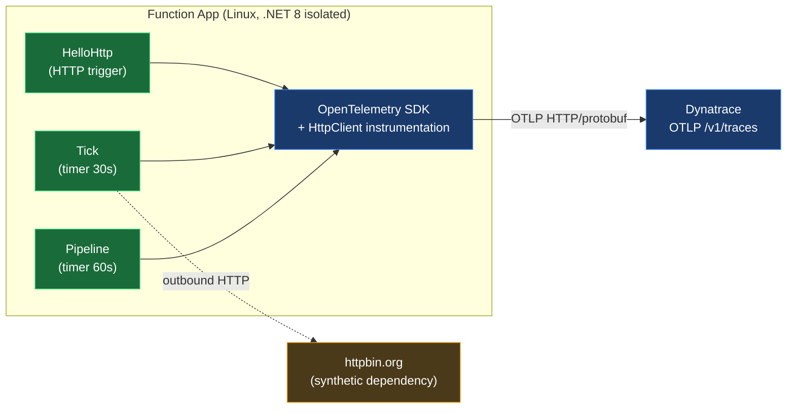

# Linux Azure Function App → OpenTelemetry → Dynatrace

A 1:1 walkthrough for instrumenting a **.NET 8 isolated worker** Azure Function App on **Linux** with OpenTelemetry, sending traces to Dynatrace via OTLP. The companion source is a minimal app that **self-generates traces on a schedule** so you can see data flowing without invoking anything manually.

This guide is built for a customer audience preparing to instrument an existing app — the focus is the **diff** (what to add to your `.csproj` and `Program.cs`) and the gotchas you will hit on Linux Functions Worker that aren't documented in the OTel quickstarts.

---

## Table of Contents

1. [What this is (and isn't)](#1-what-this-is-and-isnt)
2. [Architecture](#2-architecture)
3. [Prerequisites](#3-prerequisites)
4. [The OTel diff — applied to your existing app](#4-the-otel-diff--applied-to-your-existing-app)
   - 4.1 [`.csproj` — packages to add](#41-csproj--packages-to-add)
   - 4.2 [`Program.cs` — the wiring (and the non-obvious bits)](#42-programcs--the-wiring-and-the-non-obvious-bits)
   - 4.3 [App settings — environment variables](#43-app-settings--environment-variables)
5. [The self-generating timer functions](#5-the-self-generating-timer-functions)
6. [Provision + deploy](#6-provision--deploy)
7. [Verify in Dynatrace (validated DQL queries)](#7-verify-in-dynatrace-validated-dql-queries)
8. [Tips & gotchas](#8-tips--gotchas)
9. [Teardown](#9-teardown)
10. [Quick reference card](#10-quick-reference-card)
11. [Further reading](#11-further-reading)

---

## 1. What this is (and isn't)

**This is:**
- A working reference for the **OTel instrumentation diff** you apply to a .NET 8 isolated-worker Function App so traces reach Dynatrace.
- A documented set of **non-obvious gotchas** specific to Linux Functions Worker that the standard OTel quickstart skips over.
- A demo with **timer-driven self-generation** — once deployed, traces flow without anyone clicking anything.

**This is not:**
- A tutorial on writing Azure Functions. We assume you already have a Function App and want to add OTel.
- An OTel SDK API reference. See [opentelemetry.io/docs/languages/dotnet/](https://opentelemetry.io/docs/languages/dotnet/) for that.
- A guide for the Windows OneAgent site extension path (see the [official Dynatrace docs](https://docs.dynatrace.com/docs/ingest-from/microsoft-azure-services/azure-integrations/azure-functions/integrate-oneagent-on-azure-functions) for that). **OneAgent is Windows-only on App Service / Functions; OTel is the only path on Linux.**

---

## 2. Architecture



Three functions, one OTel pipeline, OTLP HTTP/protobuf to Dynatrace.

---

## 3. Prerequisites

| Need | Why |
|---|---|
| Azure subscription with permission to create resources in your RG | Function App + storage account |
| Existing Linux App Service Plan (B1 or higher), `--is-linux` | We do **not** create one for you. See [§ 8 Tips](#8-tips--gotchas) for why we steer away from Y1 Consumption. |
| `az` CLI logged in to the right tenant/subscription | `az account show` to verify |
| `dotnet` SDK 8.x | Build the publish artifact locally. Install on macOS without sudo: `curl -fsSL https://dot.net/v1/dotnet-install.sh \| bash -s -- --channel 8.0 --install-dir "$HOME/.dotnet"` |
| Dynatrace tenant with an API token | Token must have scope `openTelemetryTrace.ingest` (and `metrics.ingest`, `logs.ingest` if you extend later). **Token type matters** — must be `dt0c01.…` (tenant token), not `dt0a02.…` (PaaS token). |

---

## 4. The OTel diff — applied to your existing app

This is the load-bearing part. If you take nothing else from this guide, take §4.

### 4.1 `.csproj` — packages to add

Three packages — and one we deliberately skip:

```xml
<ItemGroup>
  <!-- OpenTelemetry SDK + OTLP HTTP/protobuf exporter -->
  <PackageReference Include="OpenTelemetry" Version="1.15.3" />
  <PackageReference Include="OpenTelemetry.Extensions.Hosting" Version="1.15.3" />
  <PackageReference Include="OpenTelemetry.Exporter.OpenTelemetryProtocol" Version="1.15.3" />

  <!-- Auto-instruments outbound HttpClient calls (dependency spans) -->
  <PackageReference Include="OpenTelemetry.Instrumentation.Http" Version="1.15.1" />
</ItemGroup>
```

**The package we deliberately do NOT include:** `Microsoft.Azure.Functions.Worker.OpenTelemetry`. The first-party Functions OTel package looks like the right tool — it's GA at 1.2.0 and *should* contribute invocation/trigger/binding spans automatically. In practice on Linux .NET 8 isolated worker, including this package broke worker startup with no recoverable error: the function host stayed up, but functions never registered (`/api/HelloHttp` returned 404 forever). Once removed, the host healed. We may revisit when the package matures.

> **`OBSERVED` 2026-05-08, gabriel-rg eastus, plan=B1 Linux, .NET 8 isolated, `Microsoft.Azure.Functions.Worker.Sdk` 2.0.0.** Re-test before recommending this conclusion to a customer with a different toolchain version.

### 4.2 `Program.cs` — the wiring (and the non-obvious bits)

The standard OTel-on-Functions advice — `builder.Services.AddOpenTelemetry().WithTracing(...).AddOtlpExporter()` — has **two failure modes** on Linux Functions Worker that we hit cold:

1. **`AddOtlpExporter()` is registered but never receives spans.** A `SentinelProcessor` placed in the pipeline saw activities flow; the OTLP exporter logged zero HTTP requests; `ForceFlush()` returned `true` because there was nothing in its queue. The DI/options resolution path in the helper extension wasn't hooking the exporter's processor into the live pipeline.
2. **The `TracerProvider`'s internal `ActivityListener` gets disposed.** After a worker process suspension/resume, `Source.HasListeners()` continues to return `true` (cached) but new `ActivitySource.StartActivity()` calls return `null`. The listener registration is process-wide state in the .NET runtime, and on Functions Worker something in the lifecycle clears it.

The pattern that **survives** both:

```csharp
using OpenTelemetry;
using OpenTelemetry.Exporter;
using OpenTelemetry.Resources;
using OpenTelemetry.Trace;

// 1. Belt: register a low-level ActivityListener at the TOP of Program.cs, before any
//    DI/host construction. This guarantees Source.StartActivity() returns a real
//    Activity even after the OTel SDK's internal listener gets cleared.
ActivitySourceBootstrap.RegisterListener();

var builder = FunctionsApplication.CreateBuilder(args);
builder.ConfigureFunctionsWebApplication();

var serviceName = Environment.GetEnvironmentVariable("OTEL_SERVICE_NAME") ?? "your-service";
var otlpBase    = Environment.GetEnvironmentVariable("OTEL_EXPORTER_OTLP_ENDPOINT")!;
var otlpHeaders = Environment.GetEnvironmentVariable("OTEL_EXPORTER_OTLP_HEADERS") ?? "";

// 2. Suspenders: build the TracerProvider via Sdk.CreateTracerProviderBuilder()
//    DIRECTLY (not via Services.AddOpenTelemetry()), wire the OTLP exporter as a
//    SimpleActivityExportProcessor, and PIN the TracerProvider to a STATIC field
//    so the GC can never reclaim it. The DI singleton path was observed to lose
//    the exporter wiring; the static pin keeps the listener registered for the
//    process lifetime.
TracerProviderHolder.Instance = Sdk.CreateTracerProviderBuilder()
    .ConfigureResource(r => r.AddService(serviceName))
    .AddSource("YourApp.*")                          // your ActivitySources
    .AddHttpClientInstrumentation()                  // outbound HttpClient → dep spans
    .AddProcessor(new SimpleActivityExportProcessor(
        new OtlpTraceExporter(new OtlpExporterOptions
        {
            Endpoint = new Uri(otlpBase.TrimEnd('/') + "/v1/traces"),
            Protocol = OtlpExportProtocol.HttpProtobuf,
            Headers  = otlpHeaders,
        })))
    .Build()!;

builder.Services.AddSingleton(TracerProviderHolder.Instance);
builder.Services.AddHttpClient();
builder.Build().Run();

public static class TracerProviderHolder { public static TracerProvider Instance = null!; }

public static class ActivitySourceBootstrap
{
    private static System.Diagnostics.ActivityListener? _listener;
    public static void RegisterListener()
    {
        if (_listener != null) return;
        _listener = new System.Diagnostics.ActivityListener
        {
            ShouldListenTo       = src => src.Name.StartsWith("YourApp"),
            Sample               = (ref System.Diagnostics.ActivityCreationOptions<System.Diagnostics.ActivityContext> _)
                                       => System.Diagnostics.ActivitySamplingResult.AllDataAndRecorded,
            SampleUsingParentId  = (ref System.Diagnostics.ActivityCreationOptions<string> _)
                                       => System.Diagnostics.ActivitySamplingResult.AllDataAndRecorded,
        };
        System.Diagnostics.ActivitySource.AddActivityListener(_listener);
    }
}
```

**Why `SimpleActivityExportProcessor` and not the default batch processor?** Functions Worker can suspend the process between invocations. The batch processor's background-thread flush may never run, dropping spans on suspension. The simple processor exports synchronously on every `Activity.Stop()` — slower per-span but reliable. For high-volume apps that need batching, switch back to the batch processor and call `tracerProvider.ForceFlush(2000)` at the end of every function before returning.

### 4.3 App settings — environment variables

Set these on your Function App (the `provision.sh` script does this for you):

| Setting | Value | Notes |
|---|---|---|
| `OTEL_EXPORTER_OTLP_ENDPOINT` | `https://<env>.live.dynatrace.com/api/v2/otlp` (Gen2) or your sprint tenant URL | **Base URL, no `/v1/traces`** — the SDK appends. |
| `OTEL_EXPORTER_OTLP_HEADERS` | `Authorization=Api-Token dt0c01.…` | Token in App Settings, never in any committed file. |
| `OTEL_EXPORTER_OTLP_PROTOCOL` | `http/protobuf` | Dynatrace OTLP requires protobuf (HTTP/JSON returns HTTP 415). |
| `OTEL_SERVICE_NAME` | e.g. `your-app` | Becomes `service.name` resource attribute — your filter key in DQL. |
| `OTEL_RESOURCE_ATTRIBUTES` | `azure.resource.id=/subscriptions/.../sites/<app>,deployment.environment=demo` | Lets the future Dynatrace Clouds app correlate spans to the Function App resource. |

App Insights is **not** required (and we explicitly disable it via `--disable-app-insights true` at create time). Replaces App Insights with OTel→Dynatrace cleanly.

---

## 5. The self-generating timer functions

The included `HeartbeatFunction.cs` provides two timer-triggered functions. You don't need to keep these — they exist so a fresh deploy generates traces immediately, no curl required.

**`Tick` — every 30 seconds (`*/30 * * * * *`)**
- Parent activity `heartbeat.tick` on `ActivitySource("YourApp.Heartbeat")`
- Child `outbound.http` wrapping `HttpClient.GetAsync("https://httpbin.org/uuid")` — the `AddHttpClientInstrumentation()` then auto-creates a `GET` client span nested inside, which is what shows up as a "dependency" in the trace view.
- Every 10th iteration: throws + records an exception via `Activity.AddEvent("exception", …)` — exercises the error-span path the Dynatrace handoff guide calls out as missing on classic integration.

**`Pipeline` — every 60 seconds (`0 */1 * * * *`)**
- Parent `pipeline.run` with three sequential children: `pipeline.fetch`, `pipeline.transform`, `pipeline.publish`. Each carries a different domain-specific tag (`rows`, `rules.applied`, `destination`). Demonstrates nested-span correlation in the Dynatrace trace view.

Together these produce ~3 traces per minute with ~6–10 spans, exercising: server spans (HelloHttp), internal spans (timer parents/children), client spans (HttpClient outbound), and exception events.

---

## 6. Provision + deploy

```bash
# Set the secrets (token NEVER goes into a committed file)
export DT_OTLP_ENDPOINT="https://<env>.live.dynatrace.com/api/v2/otlp"
export DT_API_TOKEN="dt0c01.…"

# Optional overrides — defaults shown
export RG=gabriel-rg
export LOCATION=eastus
export PLAN=gabriel-dt-demo-plan      # must already exist, must be Linux

# Provision: creates ONE storage account + ONE function app, tagged created-by=function_app_demo_linux
bash deploy/provision.sh

# Build the publish artifact (uses local dotnet 8 SDK, no Docker)
bash deploy/build.sh

# Push the zip
bash deploy/deploy.sh
```

`provision.sh` writes `deploy/.deploy-state` with the random suffix it generated; `deploy.sh` and `teardown.sh` read that file. **`.deploy-state` is gitignored via `~/.gitignore_global`** — never commits.

The first cold-start invocation can take ~30–60 seconds as the worker initializes. After that, timers fire on schedule and HTTP requests respond in ~200ms warm.

---

## 7. Verify in Dynatrace (validated DQL queries)

Every query below has been **validated against the live tenant** as of 2026-05-08. Replace `gabriel-otel-demo` with whatever you set `OTEL_SERVICE_NAME` to.

### Are spans landing at all?

```dql
fetch spans, from: now() - 5m
| filter service.name == "gabriel-otel-demo"
| summarize count = count(), by:{span.name, span.kind}
| sort count desc
```

Expected after ~5 min of running: rows for `heartbeat.tick`, `outbound.http`, `GET` (client), `pipeline.run` / `fetch` / `transform` / `publish`, `hello.http`. Counts of `~10` ticks and `~5` pipelines per 5-minute window.

### What does a single Tick trace look like?

```dql
fetch spans, from: now() - 30m
| filter service.name == "gabriel-otel-demo" and span.name == "heartbeat.tick"
| fields timestamp, span.name, duration, iteration
| sort timestamp desc
| limit 10
```

The `iteration` tag confirms the function is firing in order; `duration` shows how long each invocation took (typically 20–80 ms; first cold-start tick will be 500–1200 ms).

### Are dependency spans being captured?

```dql
fetch spans, from: now() - 30m
| filter service.name == "gabriel-otel-demo" and span.kind == "client"
| fields timestamp, span.name, duration, http.url
| sort timestamp desc
| limit 20
```

You'll see `GET` spans for `httpbin.org/uuid` (from `Tick`) and possibly `POST` spans (the OTLP exporter's own outbound calls being instrumented — see [§ 8 Tips](#8-tips--gotchas) for how to suppress).

### Did the synthetic exception land?

```dql
fetch spans, from: now() - 30m
| filter service.name == "gabriel-otel-demo" and matchesPhrase(span.name, "tick")
| filter events[0][`name`] == "exception"
| fields timestamp, span.name, iteration, events
| sort timestamp desc
| limit 5
```

Should appear roughly every 5 minutes (one per 10 ticks at 30s each).

---

## 8. Tips & gotchas

`OBSERVED` notes below were verified during this engagement; `DOCUMENTED` notes come from upstream docs and have not all been re-verified on every plan/SKU.

---

**Linux Consumption (Y1) is hostile to OTel as written here.** The dotnet-isolated placeholder pre-warms a generic worker and "specializes" it on first request. Specialization does not reliably re-execute every initializer in your `Program.cs`, so the OTel listener registration is flaky across cold starts. We migrated this demo to **B1 App Service Plan** specifically because Y1 was unreliable. If your customer is locked to Y1, expect to:

- Keep the `ActivitySourceBootstrap` + `TracerProviderHolder` static-pin pattern from § 4.2 (essential).
- Consider setting `WEBSITE_USE_PLACEHOLDER_DOTNETISOLATED=0` to disable the placeholder. We tested this on Y1 and the inconsistency persisted, but it may help in some configurations.
- Accept that timer triggers may miss fires across instance scale-downs, and that span counts will under-deliver vs. the schedule.

`OBSERVED` (2026-05-08).

---

**`Microsoft.Azure.Functions.Worker.OpenTelemetry` 1.2.0 broke our worker startup.** The first-party Functions OTel package, when added to the `.csproj`, prevented the function host from registering any function (404 on `/api/HelloHttp` indefinitely). Removed it, host healed. The package may work in other configurations or future versions — re-test before relying on this conclusion. `OBSERVED`.

---

**`AddOtlpExporter()` looks like it works but doesn't export.** In our setup the helper-extension form was registered, the pipeline saw spans flow through a sentinel processor, but the OTLP exporter logged zero outbound HTTP calls and `ForceFlush()` returned true (because nothing was queued). Wiring the exporter manually as `new SimpleActivityExportProcessor(new OtlpTraceExporter(opts))` (§ 4.2) fixed it. `OBSERVED`.

---

**Token type confusion — `dt0c01` vs `dt0a02`.** The OTLP endpoint accepts only **tenant tokens** (prefix `dt0c01.`). PaaS tokens (prefix `dt0a02.`) are for OneAgent installer downloads and will silently fail OTLP ingest. Validate via curl before trusting:

```bash
curl -s -o /dev/null -w "HTTP %{http_code}\n" \
  -X POST \
  -H "Authorization: Api-Token dt0c01.…" \
  -H "Content-Type: application/x-protobuf" \
  --data-binary @<(printf '') \
  "https://<env>.live.dynatrace.com/api/v2/otlp/v1/traces"
# Expect HTTP 200 (empty body is accepted as a no-op).
```

`DOCUMENTED` + `VERIFIED` 2026-05-08.

---

**Dynatrace OTLP HTTP requires protobuf, not JSON.** A request with `Content-Type: application/json` returns HTTP 415. Always set `OTEL_EXPORTER_OTLP_PROTOCOL=http/protobuf`. `VERIFIED`.

---

**The OTel exporter's own outbound calls become spans.** Because `AddHttpClientInstrumentation()` instruments every outbound HttpClient (including OTel's exporter), you'll see occasional `POST` client spans pointing at the Dynatrace OTLP endpoint itself. To suppress, configure the instrumentation:

```csharp
.AddHttpClientInstrumentation(o =>
    o.FilterHttpRequestMessage = req => !req.RequestUri!.Host.EndsWith(".dynatrace.com")
                                     && !req.RequestUri.Host.EndsWith(".dynatracelabs.com"))
```

We left it on for the demo so the customer can see a "noisy" trace and learn the suppression pattern. `OBSERVED`.

---

**Cold-start latency.** First invocation after deploy or restart can be 500–1500ms; warm invocations 20–200ms. Set timeout expectations on any synthetic tests. The handoff guide notes .NET App Service cold starts can hit 3–5 minutes for first-time container + EF Core migrations — that pattern doesn't apply to this skinny demo. `OBSERVED`.

---

**`azure.resource.id` matters for the future Clouds app.** Even though the current customer is on classic Azure integration, baking the full ARM resource ID into `OTEL_RESOURCE_ATTRIBUTES` means a later migration to Azure Native + Clouds app will correlate these spans to the Function App resource page automatically. Cheap insurance. `DOCUMENTED`.

---

**Don't commit `local.settings.json` with a real token.** Use the `.example` file. The repo's `~/.gitignore_global` excludes `*.local.json`. Belt-and-suspenders: the token only ever lives in App Settings (encrypted at rest by Azure) and the local environment variables you set before running `provision.sh`.

---

## 9. Teardown

```bash
bash deploy/teardown.sh
```

Reads `deploy/.deploy-state` and deletes **only** the storage account and function app it created (verified by the `created-by=function_app_demo_linux` tag before deletion). Refuses to delete anything else. Never touches the App Service plan, never `az group delete`. Asks for the random suffix as a confirmation.

---

## 10. Quick reference card

```
+-------------------------------------------------------------+
|  OTel → Dynatrace, Linux Function App, .NET 8 isolated      |
+-------------------------------------------------------------+
|  Packages       OpenTelemetry 1.15.3                        |
|                 OpenTelemetry.Exporter.OpenTelemetryProtocol|
|                 OpenTelemetry.Instrumentation.Http 1.15.1   |
|                                                             |
|  AVOID          Microsoft.Azure.Functions.Worker.OTel 1.2.0 |
|                                                             |
|  Wiring         Sdk.CreateTracerProviderBuilder()           |
|                   .AddSource("YourApp.*")                   |
|                   .AddHttpClientInstrumentation()           |
|                   .AddProcessor(SimpleActivityExportPro-    |
|                       cessor(new OtlpTraceExporter(opts)))  |
|                   .Build()                                  |
|                 Pin to STATIC field. Register raw           |
|                 ActivityListener at top of Program.cs.      |
|                                                             |
|  Endpoint       https://<env>.live.dynatrace.com/api/v2/otlp|
|  Protocol       http/protobuf  (NOT json — returns 415)     |
|  Token type     dt0c01.…  (NOT dt0a02.…)                    |
|  Token scope    openTelemetryTrace.ingest                   |
|                                                             |
|  Hosting plan   B1 App Service Plan — stable.               |
|                 Y1 Consumption — flaky, see § 8.            |
|                                                             |
|  DQL probe      fetch spans                                 |
|                 | filter service.name == "<your-name>"      |
|                 | summarize count(), by:{span.name}         |
+-------------------------------------------------------------+
```

---

## 11. Further reading

- [Dynatrace — Ingest traces (OTel)](https://docs.dynatrace.com/docs/observe/application-observability/distributed-tracing/ingest-traces)
- [Azure Functions — .NET isolated worker overview](https://learn.microsoft.com/en-us/azure/azure-functions/dotnet-isolated-process-guide)
- [OpenTelemetry .NET — Tracing API](https://opentelemetry.io/docs/languages/dotnet/instrumentation/)
- [OTLP HTTP exporter — env var spec](https://github.com/open-telemetry/opentelemetry-specification/blob/main/specification/protocol/exporter.md)

---

> **Disclaimer:** This guide is AI-assisted and intended for reference and learning purposes only. It may contain inaccuracies, incomplete information, or content that has drifted from current product behavior — always consult the [official Dynatrace documentation](https://docs.dynatrace.com) for authoritative guidance. This is not an official Dynatrace resource.
