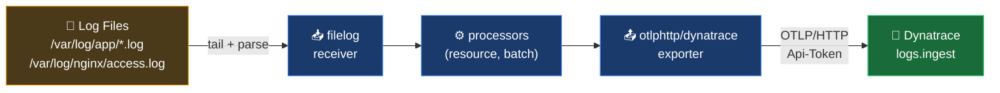

# Ingest Logs from Files with the OpenTelemetry Collector

A practical guide for collecting logs from files — application logs, system logs, access logs — and shipping them to Dynatrace using the OTel Collector's `filelog` receiver.

---

## Table of Contents

1. [How It Works](#how-it-works)
2. [Prerequisites](#prerequisites)
3. [Basic Setup](#basic-setup)
4. [Parsing Log Formats](#parsing-log-formats)
   - [JSON Logs](#json-logs)
   - [Plain Text / Regex Logs](#plain-text--regex-logs)
   - [Extracting Timestamps](#extracting-timestamps)
   - [Mapping Severity Levels](#mapping-severity-levels)
5. [File Rotation & Checkpointing](#file-rotation--checkpointing)
6. [Enriching Logs with Resource Attributes](#enriching-logs-with-resource-attributes)
7. [Multiline Logs](#multiline-logs)
8. [Complete Pipeline Examples](#complete-pipeline-examples)
   - [JSON Application Logs](#json-application-logs)
   - [Nginx Access Logs](#nginx-access-logs)
   - [Java Exception Logs (Multiline)](#java-exception-logs-multiline)
9. [Verifying Logs in Dynatrace](#verifying-logs-in-dynatrace)
10. [Tips](#tips)

---

## How It Works

The `filelog` receiver tails one or more files on disk, parses each line into a log record, and forwards it through the Collector pipeline to Dynatrace via OTLP.



Each log line becomes one log record in Dynatrace with:
- **Timestamp** — parsed from the log line, or the ingestion time if not parsed
- **Severity** — mapped from log level strings (`INFO`, `ERROR`, etc.)
- **Content** — the raw log line or parsed body
- **Attributes** — fields extracted by operators (method, status, path, etc.)
- **Resource attributes** — added by processors (`service.name`, `host.name`, etc.)

---

## Prerequisites

**Dynatrace Collector** (recommended) or **OTel Collector Contrib** distribution — the core OTel Collector does not include the `filelog` receiver. The Contrib and Dynatrace distributions do.

**API token** with `logs.ingest` scope.

**Collector installed** and accessible to the log files. When running in Kubernetes, this typically means a DaemonSet with a hostPath volume mount.

---

## Basic Setup

The minimum configuration to tail a file and send lines to Dynatrace:

```yaml
receivers:
  filelog:
    include:
      - /var/log/myapp/*.log
    start_at: end                # tail new lines only; use "beginning" for historical backfill

exporters:
  otlphttp/dynatrace:
    endpoint: "https://{environment-id}.live.dynatrace.com/api/v2/otlp"
    headers:
      Authorization: "Api-Token ${DT_API_TOKEN}"

service:
  pipelines:
    logs:
      receivers: [filelog]
      exporters: [otlphttp/dynatrace]
```

This sends each log line as a raw string. No timestamp or severity parsing yet — those require operators.

---

## Parsing Log Formats

Operators transform raw log lines into structured log records. They run in sequence — the output of one feeds the next.

---

### JSON Logs

Use `json_parser` when your app writes structured JSON logs (common with Logback JSON encoder, Pino, structlog, etc.).

**Example log line:**
```json
{"timestamp":"2024-11-15T14:32:01Z","level":"ERROR","message":"Payment failed","order_id":"ORD-9921","amount":149.99}
```

**Collector config:**
```yaml
receivers:
  filelog:
    include:
      - /var/log/myapp/*.log
    start_at: end
    operators:
      - type: json_parser
        timestamp:
          parse_from: attributes.timestamp
          layout: '%Y-%m-%dT%H:%M:%SZ'
        severity:
          parse_from: attributes.level
```

**What this produces in Dynatrace:**

| Field | Value |
|-------|-------|
| Timestamp | `2024-11-15T14:32:01Z` (parsed from the log) |
| Severity | `ERROR` |
| Content | `Payment failed` |
| `order_id` | `ORD-9921` |
| `amount` | `149.99` |

> **Note:** After `json_parser` runs, all JSON keys become log attributes. You can reference them as `attributes.<key>` in subsequent operators.

---

### Plain Text / Regex Logs

Use `regex_parser` for unstructured or fixed-format text logs. Named capture groups `(?P<name>...)` become log attributes.

**Example log line (custom app format):**
```
2024-11-15 14:32:01 ERROR [checkout-service] Payment failed for order ORD-9921
```

**Collector config:**
```yaml
receivers:
  filelog:
    include:
      - /var/log/myapp/*.log
    start_at: end
    operators:
      - type: regex_parser
        regex: '^(?P<log_time>\d{4}-\d{2}-\d{2} \d{2}:\d{2}:\d{2}) (?P<severity>\w+) \[(?P<service>[^\]]+)\] (?P<message>.+)$'
        timestamp:
          parse_from: attributes.log_time
          layout: '%Y-%m-%d %H:%M:%S'
        severity:
          parse_from: attributes.severity
```

**What this produces in Dynatrace:**

| Field | Value |
|-------|-------|
| Timestamp | `2024-11-15T14:32:01Z` |
| Severity | `ERROR` |
| `service` | `checkout-service` |
| `message` | `Payment failed for order ORD-9921` |

**Nginx access log example:**

```
192.168.1.10 - - [15/Nov/2024:14:32:01 +0000] "POST /api/checkout HTTP/1.1" 500 3421 0.245
```

```yaml
operators:
  - type: regex_parser
    regex: '^(?P<client_ip>[\d.]+) \S+ \S+ \[(?P<log_time>[^\]]+)\] "(?P<method>\w+) (?P<path>[^\s"]+)[^"]*" (?P<status>\d+) (?P<bytes>\d+) (?P<duration>[\d.]+)$'
    timestamp:
      parse_from: attributes.log_time
      layout: '%d/%b/%Y:%H:%M:%S %z'
    severity:
      parse_from: attributes.status
      mapping:
        error: ["5xx"]
        warn: ["4xx"]
        info: ["2xx", "3xx"]
```

---

### Extracting Timestamps

Timestamp parsing is critical — without it, Dynatrace uses ingestion time, which makes log ordering unreliable for historical data.

| Layout directive | Meaning | Example |
|-----------------|---------|---------|
| `%Y` | 4-digit year | `2024` |
| `%m` | 2-digit month | `11` |
| `%b` | Abbreviated month name | `Nov` |
| `%d` | 2-digit day | `15` |
| `%H` | Hour (24h) | `14` |
| `%M` | Minute | `32` |
| `%S` | Second | `01` |
| `%L` | Millisecond, zero-padded | `123` |
| `%z` | Timezone offset `±HHMM` | `+0000` |
| `%Z` | Timezone name or abbreviation | `UTC` |

**Common timestamp formats:**

```yaml
# ISO 8601: 2024-11-15T14:32:01Z
layout: '%Y-%m-%dT%H:%M:%SZ'

# ISO 8601 with offset: 2024-11-15T14:32:01+0000
layout: '%Y-%m-%dT%H:%M:%S%z'

# Common log format: 15/Nov/2024:14:32:01 +0000
layout: '%d/%b/%Y:%H:%M:%S %z'

# Epoch seconds (no layout needed)
layout_type: epoch
layout: s

# Epoch milliseconds
layout_type: epoch
layout: ms
```

---

### Mapping Severity Levels

The `severity` operator maps strings in your logs to OTel severity levels, which Dynatrace displays as log severity.

```yaml
operators:
  - type: json_parser
    severity:
      parse_from: attributes.level
      mapping:
        fatal: FATAL
        error: [ERROR, ERR, CRIT, CRITICAL]
        warn: [WARN, WARNING]
        info: [INFO, INFORMATION]
        debug: [DEBUG, TRACE, VERBOSE]
```

This handles any variation your app or framework uses (`WARNING` vs `WARN`, `CRITICAL` vs `ERROR`, etc.).

---

## File Rotation & Checkpointing

By default, the `filelog` receiver loses its position when the Collector restarts — it will either re-read from the beginning or miss lines written during the downtime.

The `file_storage` extension persists file read offsets to disk, preventing both duplicate ingestion and data loss across restarts.

```yaml
extensions:
  file_storage:
    directory: /var/lib/otelcol/filelogstorage    # must be writable by the Collector process
    timeout: 1s

receivers:
  filelog:
    include:
      - /var/log/myapp/*.log
    start_at: end
    storage: file_storage                          # reference the extension here

service:
  extensions: [file_storage]                      # must also be declared in service.extensions
  pipelines:
    logs:
      receivers: [filelog]
      exporters: [otlphttp/dynatrace]
```

**File rotation behavior:**

The `filelog` receiver handles log rotation (both move/create and copy/truncate strategies) transparently. Configure how it handles truncation:

```yaml
receivers:
  filelog:
    include:
      - /var/log/myapp/*.log
    start_at: end
    storage: file_storage
    on_truncate: read_new    # after truncation, read only new lines written after the truncation point
                             # alternatives: "ignore" (keep old offset), "read_whole_file" (restart from 0)
```

For logrotate-managed files, `read_new` is the right default.

---

## Enriching Logs with Resource Attributes

Use the `resource` processor to attach service identity and environment context to all logs passing through the pipeline. These attributes appear as dimensions in Dynatrace Log Management.

```yaml
processors:
  resource:
    attributes:
      - key: service.name
        value: checkout-service
        action: insert
      - key: service.version
        value: "2.1.0"
        action: insert
      - key: deployment.environment.name
        value: production
        action: insert
      - key: host.name
        from_attribute: host.name    # populated automatically by the resourcedetection processor
        action: insert

  resourcedetection:
    detectors: [system, env]         # auto-detects host.name, os.type, etc.
    timeout: 5s
    override: false

  batch:
    timeout: 5s
    send_batch_size: 1024
```

**Recommended resource attributes for Dynatrace log correlation:**

| Attribute | Purpose |
|-----------|---------|
| `service.name` | Links log to the Dynatrace Service entity |
| `service.version` | Shown in log context; useful for deployment correlation |
| `deployment.environment.name` | Filters logs by environment in Dynatrace |
| `host.name` | Links log to the Dynatrace Host entity |
| `k8s.pod.name` | Links log to the Kubernetes Pod entity |
| `k8s.namespace.name` | Links log to the Kubernetes Namespace entity |
| `k8s.container.name` | Identifies the container within a pod |

---

## Multiline Logs

Some log entries span multiple lines — Java stack traces, Python tracebacks, structured text blocks. Without multiline config, each line is ingested as a separate log record.

Use `multiline` to define where a new log entry starts:

**Java stack trace example:**
```
2024-11-15 14:32:01 ERROR [payment-service] Unhandled exception
java.lang.NullPointerException: Cannot invoke method charge()
    at com.example.PaymentService.process(PaymentService.java:42)
    at com.example.OrderController.checkout(OrderController.java:88)
```

```yaml
receivers:
  filelog:
    include:
      - /var/log/myapp/*.log
    start_at: end
    multiline:
      line_start_pattern: '^\d{4}-\d{2}-\d{2} \d{2}:\d{2}:\d{2}'    # new entry starts with a timestamp
    operators:
      - type: regex_parser
        regex: '^(?P<log_time>\d{4}-\d{2}-\d{2} \d{2}:\d{2}:\d{2}) (?P<severity>\w+) \[(?P<service>[^\]]+)\] (?P<message>[\s\S]+)$'
        timestamp:
          parse_from: attributes.log_time
          layout: '%Y-%m-%d %H:%M:%S'
        severity:
          parse_from: attributes.severity
```

The entire stack trace is now a single log record with `message` containing all lines.

You can also define the **end** of an entry instead of the start:

```yaml
multiline:
  line_end_pattern: '(END|---)'
```

---

## Complete Pipeline Examples

---

### JSON Application Logs

Full collector config for a service writing JSON logs with file rotation and environment enrichment:

```yaml
extensions:
  file_storage:
    directory: /var/lib/otelcol/filelogstorage

receivers:
  filelog:
    include:
      - /var/log/checkout-service/*.log
    exclude:
      - /var/log/checkout-service/*.gz      # skip rotated compressed files
    start_at: end
    storage: file_storage
    on_truncate: read_new
    poll_interval: 500ms
    operators:
      - type: json_parser
        timestamp:
          parse_from: attributes.timestamp
          layout: '%Y-%m-%dT%H:%M:%S%z'
        severity:
          parse_from: attributes.level
          mapping:
            fatal: FATAL
            error: [ERROR, ERR, CRIT]
            warn: [WARN, WARNING]
            info: [INFO]
            debug: [DEBUG, TRACE]
      - type: move                           # promote parsed message to log body
        from: attributes.message
        to: body

processors:
  resource:
    attributes:
      - key: service.name
        value: checkout-service
        action: insert
      - key: deployment.environment.name
        value: ${DEPLOYMENT_ENV}
        action: insert
  resourcedetection:
    detectors: [system, env]
    timeout: 5s
  batch:
    timeout: 5s
    send_batch_size: 1024

exporters:
  otlphttp/dynatrace:
    endpoint: "https://{environment-id}.live.dynatrace.com/api/v2/otlp"
    headers:
      Authorization: "Api-Token ${DT_API_TOKEN}"

service:
  extensions: [file_storage]
  pipelines:
    logs:
      receivers: [filelog]
      processors: [resourcedetection, resource, batch]
      exporters: [otlphttp/dynatrace]
```

---

### Nginx Access Logs

Full config for parsing Nginx combined access log format and sending to Dynatrace:

```yaml
# Example log line:
# 10.0.0.5 - user1 [15/Nov/2024:14:32:01 +0000] "GET /api/products HTTP/1.1" 200 1842 "-" "Mozilla/5.0" 0.042

extensions:
  file_storage:
    directory: /var/lib/otelcol/filelogstorage

receivers:
  filelog:
    include:
      - /var/log/nginx/access.log
    start_at: end
    storage: file_storage
    operators:
      - type: regex_parser
        regex: '^(?P<client_ip>[\d.]+) \S+ (?P<user>\S+) \[(?P<log_time>[^\]]+)\] "(?P<method>\w+) (?P<path>[^\s"]+)[^"]*" (?P<status>\d+) (?P<bytes>\d+) "[^"]*" "(?P<user_agent>[^"]*)" (?P<duration>[\d.]+)$'
        timestamp:
          parse_from: attributes.log_time
          layout: '%d/%b/%Y:%H:%M:%S %z'
        severity:
          parse_from: attributes.status
          mapping:
            error: 5xx
            warn: 4xx
            info: 2xx

processors:
  resource:
    attributes:
      - key: service.name
        value: nginx
        action: insert
      - key: deployment.environment.name
        value: production
        action: insert
  batch:
    timeout: 5s

exporters:
  otlphttp/dynatrace:
    endpoint: "https://{environment-id}.live.dynatrace.com/api/v2/otlp"
    headers:
      Authorization: "Api-Token ${DT_API_TOKEN}"

service:
  extensions: [file_storage]
  pipelines:
    logs:
      receivers: [filelog]
      processors: [resource, batch]
      exporters: [otlphttp/dynatrace]
```

---

### Java Exception Logs (Multiline)

Full config for a Java application using Log4j2 or Logback with stack traces:

```yaml
# Example log lines:
# 2024-11-15 14:32:01,123 ERROR [http-nio-8080-exec-3] c.e.PaymentService - Payment processing failed
# java.lang.IllegalArgumentException: Invalid card number
#     at com.example.PaymentService.validate(PaymentService.java:55)
#     at com.example.OrderController.checkout(OrderController.java:92)

extensions:
  file_storage:
    directory: /var/lib/otelcol/filelogstorage

receivers:
  filelog:
    include:
      - /var/log/myapp/application.log
    start_at: end
    storage: file_storage
    multiline:
      line_start_pattern: '^\d{4}-\d{2}-\d{2} \d{2}:\d{2}:\d{2}'
    operators:
      - type: regex_parser
        regex: '^(?P<log_time>\d{4}-\d{2}-\d{2} \d{2}:\d{2}:\d{2},\d{3}) (?P<severity>\w+) \[(?P<thread>[^\]]+)\] (?P<logger>\S+) - (?P<message>[\s\S]+)$'
        timestamp:
          parse_from: attributes.log_time
          layout: '%Y-%m-%d %H:%M:%S,%L'
        severity:
          parse_from: attributes.severity
          mapping:
            fatal: FATAL
            error: ERROR
            warn: WARN
            info: INFO
            debug: DEBUG
            trace: TRACE

processors:
  resource:
    attributes:
      - key: service.name
        value: payment-service
        action: insert
      - key: service.version
        value: ${APP_VERSION}
        action: insert
      - key: deployment.environment.name
        value: ${DEPLOYMENT_ENV}
        action: insert
  resourcedetection:
    detectors: [system, env]
  batch:
    timeout: 5s
    send_batch_size: 512

exporters:
  otlphttp/dynatrace:
    endpoint: "https://{environment-id}.live.dynatrace.com/api/v2/otlp"
    headers:
      Authorization: "Api-Token ${DT_API_TOKEN}"

service:
  extensions: [file_storage]
  pipelines:
    logs:
      receivers: [filelog]
      processors: [resourcedetection, resource, batch]
      exporters: [otlphttp/dynatrace]
```

---

## Verifying Logs in Dynatrace

After starting the Collector:

1. **Check Collector health** — look for errors in stdout or the Collector's own logs:
   ```bash
   # If running as a process:
   ./otelcol --config collector.yaml

   # Watch for lines like:
   # {"kind": "receiver", "name": "filelog", "data_type": "logs"} ... Started logreceiver
   # ERROR ... failed to export log data
   ```

2. **Query in Dynatrace Logs** — open Log Management & Analytics and run:
   ```
   fetch logs
   | filter service.name == "checkout-service"
   | sort timestamp desc
   | limit 50
   ```

3. **Check attribute parsing** — verify fields were extracted:
   ```
   fetch logs
   | filter service.name == "checkout-service" and loglevel == "ERROR"
   | fields timestamp, content, order_id, http.status_code
   | sort timestamp desc
   ```

4. **Confirm timestamps are correct** — if all logs show the same ingest timestamp, your timestamp parsing failed. Check that `parse_from` points to the right attribute name.

---

## Tips

---

### Always use `file_storage` in production

Without it, a Collector restart re-reads from `start_at: beginning` (or loses new lines if `start_at: end`). This causes either duplicate logs or a gap in log coverage.

```yaml
extensions:
  file_storage:
    directory: /var/lib/otelcol/filelogstorage   # create this dir and ensure it's writable
```

One missed restart can flood Dynatrace with millions of duplicate log records — the storage extension costs nothing and prevents that entirely.

---

### Test your regex locally before deploying

Use [regex101.com](https://regex101.com) with the Go flavor to validate named capture groups. Paste a real log line and verify every `(?P<name>...)` group captures what you expect.

A regex that doesn't match silently passes the raw line through unparsed — no error is thrown. If you see logs in Dynatrace with no parsed attributes, your regex has a mismatch.

---

### `start_at: beginning` is a one-time backfill tool

Using `start_at: beginning` without `file_storage` re-reads the entire file on every Collector restart. Only use it for initial historical backfill, then switch to `end` once you're caught up.

---

### The `move` operator promotes fields to log body

After `json_parser`, the log body is still the raw JSON string and all parsed keys are in attributes. Use `move` to set the body to the human-readable message field:

```yaml
operators:
  - type: json_parser
    ...
  - type: move
    from: attributes.message
    to: body
```

This makes the log content readable in Dynatrace's log viewer without expanding attributes.

---

### Environment variables in collector.yaml

Reference env vars with `${VAR_NAME}` anywhere in the config:

```yaml
exporters:
  otlphttp/dynatrace:
    headers:
      Authorization: "Api-Token ${DT_API_TOKEN}"

processors:
  resource:
    attributes:
      - key: deployment.environment.name
        value: ${DEPLOY_ENV}
        action: insert
```

Run the Collector with the vars set:

```bash
DT_API_TOKEN="dt0c01.***" DEPLOY_ENV="production" ./otelcol --config collector.yaml
```

Or use a `.env`-style systemd unit or Docker `--env-file` to keep tokens out of the config file.

---

## Further Reading

- [filelog receiver — OpenTelemetry Collector Contrib](https://github.com/open-telemetry/opentelemetry-collector-contrib/tree/main/receiver/filelogreceiver)
- [file_storage extension — OpenTelemetry Collector Contrib](https://github.com/open-telemetry/opentelemetry-collector-contrib/tree/main/extension/storage/filestorage)
- [Operators reference — OpenTelemetry Contrib](https://github.com/open-telemetry/opentelemetry-collector-contrib/blob/main/pkg/stanza/docs/operators/README.md)
- [Dynatrace Logs ingestion API](https://docs.dynatrace.com/docs/ingest-from/opentelemetry/otlp-api)
- [Dynatrace Collector documentation](https://docs.dynatrace.com/docs/ingest-from/opentelemetry/collector)

---

> **Disclaimer:** This guide is AI-assisted and intended for reference and learning purposes only. It may contain inaccuracies, incomplete information, or content that has drifted from current product behavior — always consult the [official Dynatrace documentation](https://docs.dynatrace.com) for authoritative guidance. This is not an official Dynatrace resource.
