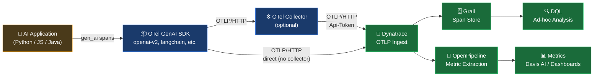

# AI Observability: Extracting Metrics from OTel GenAI Spans in Dynatrace

A quick reference for turning OpenTelemetry generative AI spans into actionable metrics — token usage, latency, error rates, and model cost signals — using Dynatrace DQL and OpenPipeline.

---

## Table of Contents

1. [How It Works](#how-it-works)
2. [GenAI Span Attributes](#genai-span-attributes)
   - [Core Attributes](#core-attributes)
   - [Token Usage](#token-usage)
   - [Request Parameters](#request-parameters)
   - [Agent & Tool Attributes](#agent--tool-attributes)
   - [Attribute Compatibility Note](#attribute-compatibility-note)
3. [Querying Spans with DQL](#querying-spans-with-dql)
   - [Inspect Raw Spans](#inspect-raw-spans)
   - [Token Usage by Model](#token-usage-by-model)
   - [Latency Percentiles](#latency-percentiles)
   - [Token Usage Timeseries](#token-usage-timeseries)
   - [Latency Timeseries](#latency-timeseries)
   - [Finish Reason Distribution](#finish-reason-distribution)
   - [Error Detection](#error-detection)
   - [Token Efficiency Ratio](#token-efficiency-ratio)
   - [Usage by Service and Model](#usage-by-service-and-model)
4. [Extracting Metrics with OpenPipeline](#extracting-metrics-with-openpipeline)
   - [Metric Types](#metric-types)
   - [Recommended Metrics to Extract](#recommended-metrics-to-extract)
   - [OpenPipeline Configuration](#openpipeline-configuration)
5. [Common Patterns & Recipes](#common-patterns--recipes)
6. [Tips](#tips)
7. [Quick Reference Card](#quick-reference-card)
8. [Further Reading](#further-reading)

---

## How It Works

AI applications instrumented with the OTel GenAI SDK emit spans for every model call — `chat`, `embeddings`, `invoke_agent`, `execute_tool`, and more. Each span carries token counts, latency, model name, and provider directly as span attributes.

Dynatrace ingests these spans over OTLP, stores them in Grail, and lets you query them in real time with DQL. OpenPipeline can extract persistent metrics from those spans at ingest time, feeding dashboards and Davis AI alerting.



---

## GenAI Span Attributes

All `gen_ai.*` attributes are part of the [OTel GenAI Semantic Conventions](https://opentelemetry.io/docs/specs/semconv/gen-ai/) (stability: Development as of early 2026). They are directly addressable in DQL by name.

### Core Attributes

| Attribute | Type | Requirement | Description | Example |
|---|---|---|---|---|
| `gen_ai.operation.name` | string | Required | Operation type | `chat`, `embeddings`, `invoke_agent`, `execute_tool`, `retrieval` |
| `gen_ai.provider.name` | string | Required | Provider identifier | `openai`, `aws.bedrock`, `anthropic`, `azure.ai.openai`, `gcp.gemini` |
| `gen_ai.system` | string | Deprecated | Older alias for `gen_ai.provider.name` — still emitted by many SDKs | `openai` |
| `gen_ai.request.model` | string | Conditionally Required | Model requested | `gpt-4o`, `claude-3-5-sonnet` |
| `gen_ai.response.model` | string | Recommended | Exact model version that responded | `gpt-4o-2024-11-20` |
| `gen_ai.response.id` | string | Recommended | Unique completion ID | `chatcmpl-abc123` |
| `gen_ai.response.finish_reasons` | string[] | Recommended | Why generation stopped | `["stop"]`, `["tool_calls"]`, `["length"]` |
| `gen_ai.conversation.id` | string | Conditionally Required | Session or thread identifier | `conv_xyz789` |
| `gen_ai.output.type` | string | Conditionally Required | Content type requested | `text`, `json`, `image`, `speech` |
| `error.type` | string | Conditionally Required | Error class if span failed | `TimeoutError`, `RateLimitError` |
| `server.address` | string | Recommended | LLM API hostname | `api.openai.com` |

### Token Usage

| Attribute | Type | Requirement | Description |
|---|---|---|---|
| `gen_ai.usage.input_tokens` | int | Recommended | Prompt tokens consumed |
| `gen_ai.usage.output_tokens` | int | Recommended | Completion tokens generated |
| `gen_ai.usage.cache_read.input_tokens` | int | Recommended | Input tokens served from provider cache |
| `gen_ai.usage.cache_creation.input_tokens` | int | Recommended | Input tokens written to provider cache |

> **Older SDKs** (pre-v1.38 Traceloop/OpenLLMetry): emit `gen_ai.usage.prompt_tokens` and `gen_ai.usage.completion_tokens` instead. Use `coalesce()` in DQL to handle both: `coalesce(gen_ai.usage.input_tokens, gen_ai.usage.prompt_tokens)`.

### Request Parameters

| Attribute | Type | Description | Example |
|---|---|---|---|
| `gen_ai.request.max_tokens` | int | Token limit cap on the request | `1024` |
| `gen_ai.request.temperature` | double | Sampling temperature | `0.7` |
| `gen_ai.request.top_p` | double | Nucleus sampling parameter | `1.0` |
| `gen_ai.request.frequency_penalty` | double | Frequency penalty | `0.0` |
| `gen_ai.request.presence_penalty` | double | Presence penalty | `0.0` |
| `gen_ai.request.stop_sequences` | string[] | Sequences that halt generation | `["END"]` |

### Agent & Tool Attributes

| Attribute | Type | Description |
|---|---|---|
| `gen_ai.agent.id` | string | Unique agent identifier |
| `gen_ai.agent.name` | string | Human-readable agent name |
| `gen_ai.tool.name` | string | Name of the tool invoked |
| `gen_ai.tool.type` | string | Tool type: `function`, `extension`, `datastore` |
| `gen_ai.data_source.id` | string | RAG knowledge base identifier |

### Attribute Compatibility Note

Many production AI applications today use [Traceloop / OpenLLMetry](https://github.com/traceloop/openllmetry) or older OTel contrib instrumentation. These emit the **deprecated** attribute names. The table below shows what to expect and how to handle both in DQL:

| Deprecated (older SDKs) | Current (new SDKs) | DQL coalesce pattern |
|---|---|---|
| `gen_ai.system` | `gen_ai.provider.name` | `coalesce(gen_ai.provider.name, gen_ai.system)` |
| `gen_ai.usage.prompt_tokens` | `gen_ai.usage.input_tokens` | `coalesce(gen_ai.usage.input_tokens, gen_ai.usage.prompt_tokens)` |
| `gen_ai.usage.completion_tokens` | `gen_ai.usage.output_tokens` | `coalesce(gen_ai.usage.output_tokens, gen_ai.usage.completion_tokens)` |

> Confirmed on this tenant: `gen_ai.system` is the active attribute (value `openai`); `gen_ai.provider.name` was null on all sampled spans.

---

## Querying Spans with DQL

All queries below are validated against the live tenant. Duration values are in **nanoseconds** — divide by `1000000` for milliseconds.

---

### Inspect Raw Spans

Explore what attributes your instrumentation is emitting. Start here to understand your data shape.

```dql
fetch spans
| filter isNotNull(`gen_ai.operation.name`)
| fields `gen_ai.operation.name`,
         `gen_ai.request.model`,
         `gen_ai.response.model`,
         coalesce(`gen_ai.provider.name`, `gen_ai.system`) as provider,
         `gen_ai.usage.input_tokens`,
         `gen_ai.usage.output_tokens`,
         `gen_ai.response.finish_reasons`,
         duration,
         `service.name`,
         `request.is_failed`
| limit 50
```

> *Syntax validated, live data returned.*

---

### Token Usage by Model

Total and average token consumption broken down by model and provider. Use this for capacity planning and cost attribution.

```dql
fetch spans
| filter isNotNull(`gen_ai.operation.name`)
| summarize by:{`gen_ai.request.model`, coalesce(`gen_ai.provider.name`, `gen_ai.system`)},
    {total_input_tokens  = sum(`gen_ai.usage.input_tokens`),
     total_output_tokens = sum(`gen_ai.usage.output_tokens`),
     avg_input_tokens    = avg(`gen_ai.usage.input_tokens`),
     avg_output_tokens   = avg(`gen_ai.usage.output_tokens`),
     request_count       = count()}
| sort total_input_tokens desc
```

> *Syntax validated, live data returned.*

---

### Latency Percentiles

Response time distribution per model and service. Use p99 to set alerting thresholds and SLOs.

```dql
fetch spans
| filter isNotNull(`gen_ai.operation.name`)
| summarize by:{`gen_ai.request.model`, `service.name`},
    {p50_ms  = percentile(duration, 50)  / 1000000,
     p90_ms  = percentile(duration, 90)  / 1000000,
     p99_ms  = percentile(duration, 99)  / 1000000,
     requests = count()}
| sort p99_ms desc
```

> *Syntax validated, live data returned.*

---

### Token Usage Timeseries

Rolling token consumption over time — the foundation for a token burn rate dashboard.

```dql
fetch spans
| filter isNotNull(`gen_ai.usage.input_tokens`) and isNotNull(`gen_ai.usage.output_tokens`)
| makeTimeseries interval:5m,
    {input_tokens  = sum(`gen_ai.usage.input_tokens`),
     output_tokens = sum(`gen_ai.usage.output_tokens`)}
```

Split by model:

```dql
fetch spans
| filter isNotNull(`gen_ai.usage.input_tokens`) and isNotNull(`gen_ai.usage.output_tokens`)
| makeTimeseries interval:5m, by:{`gen_ai.request.model`},
    input_tokens = sum(`gen_ai.usage.input_tokens`)
```

> *Syntax validated, live data returned.*

---

### Latency Timeseries

Average model response latency over time. Note: `makeTimeseries` does not support inline math — result is in nanoseconds.

```dql
fetch spans
| filter isNotNull(`gen_ai.operation.name`)
| makeTimeseries interval:5m, by:{`gen_ai.request.model`},
    avg_duration_ns = avg(duration)
```

> *Syntax validated, live data returned. Divide avg_duration_ns by 1,000,000 in your dashboard panel for milliseconds.*

---

### Finish Reason Distribution

Shows how your model calls are completing: `stop` (normal), `tool_calls` (agent tool use), `length` (truncated), `content_filter` (safety).

```dql
fetch spans
| filter isNotNull(`gen_ai.operation.name`)
| summarize by:{`gen_ai.response.finish_reasons`},
    {request_count = count()}
| sort request_count desc
```

> *Syntax validated, live data returned (confirmed: `["stop"]` and `["tool_calls"]` on this tenant).*

---

### Error Detection

Spans where the AI call failed — either marked failed by Dynatrace or carrying an `error.type` attribute.

```dql
fetch spans
| filter isNotNull(`gen_ai.operation.name`)
| filter `request.is_failed` == true OR isNotNull(`error.type`)
| summarize by:{`gen_ai.request.model`, `gen_ai.operation.name`, `error.type`},
    {error_count = count()}
| sort error_count desc
```

> *Syntax validated, no errors returned on this tenant (no failures in current window).*

---

### Token Efficiency Ratio

Output-to-input token ratio — a low ratio (< 0.1) may indicate prompts that are too long relative to what the model returns. High ratios (> 1.0) indicate verbose responses.

```dql
fetch spans
| filter isNotNull(`gen_ai.usage.input_tokens`) and isNotNull(`gen_ai.usage.output_tokens`)
| fieldsAdd token_ratio = toDouble(`gen_ai.usage.output_tokens`) / toDouble(`gen_ai.usage.input_tokens`)
| summarize by:{`gen_ai.request.model`},
    {avg_input_tokens  = avg(`gen_ai.usage.input_tokens`),
     avg_output_tokens = avg(`gen_ai.usage.output_tokens`),
     avg_ratio         = avg(token_ratio),
     total_tokens      = sum(`gen_ai.usage.input_tokens`) + sum(`gen_ai.usage.output_tokens`)}
```

> *Syntax validated, live data returned.*

---

### Usage by Service and Model

Token consumption and latency broken down by the service calling the model — useful for chargeback and identifying which application is the heaviest consumer.

```dql
fetch spans
| filter isNotNull(`gen_ai.operation.name`)
| summarize by:{`gen_ai.request.model`, `service.name`},
    {total_input  = sum(`gen_ai.usage.input_tokens`),
     total_output = sum(`gen_ai.usage.output_tokens`),
     p99_ms       = percentile(duration, 99) / 1000000,
     requests     = count()}
| sort total_input desc
```

> *Syntax validated, live data returned.*

---

## Extracting Metrics with OpenPipeline

OpenPipeline processes spans at ingest time and emits persistent metrics into Dynatrace. These metrics work with Davis AI anomaly detection, SLO definitions, and time-series dashboards — without re-querying raw spans.

### Metric Types

| Type | Behavior | Use For |
|---|---|---|
| `counter` | Counts matching spans | Request count, error count |
| `gauge` | Extracts a numeric field from each span | Token counts per call, max tokens, temperature |
| `histogram` | Captures value distribution | Latency, token distribution |

### Recommended Metrics to Extract

| Metric Key | Type | Source Field | Dimensions | Purpose |
|---|---|---|---|---|
| `span.genai.requests` | counter | — | model, provider, operation, service | Total request volume |
| `span.genai.errors` | counter | — | model, provider, error.type, service | Error rate |
| `span.genai.input_tokens` | gauge | `gen_ai.usage.input_tokens` | model, provider, service | Input token burn rate |
| `span.genai.output_tokens` | gauge | `gen_ai.usage.output_tokens` | model, provider, service | Output token burn rate |
| `span.genai.duration` | histogram | `duration` (measurement type) | model, provider, operation, service | Latency SLO |

> Keep dimensions low-cardinality. Never use `gen_ai.conversation.id`, `gen_ai.response.id`, or user identifiers as dimensions.

### OpenPipeline Configuration

Configure via **Dynatrace > OpenPipeline > Distributed Traces > Spans**. The following examples show the processor settings for each recommended metric.

> **Note:** The JSON structure below reflects the OpenPipeline Settings API schema (`builtin:openpipeline.spans.pipelines`). Verify field names in your tenant's OpenPipeline UI before applying programmatically — field names in the UI may differ slightly from the API schema.

---

**Route: Scope to GenAI spans only**

Add a dynamic route condition at the top of your pipeline to match only AI spans:

```
isNotNull(gen_ai.operation.name)
```

---

**Request counter**

Counts every GenAI span. Split by model, provider (coalescing old and new attribute names), operation, and service.

```json
{
  "name": "GenAI request count",
  "metricKey": "span.genai.requests",
  "type": "counter",
  "samplingAware": true,
  "dimensions": [
    { "type": "custom",     "fieldName": "gen_ai.request.model" },
    { "type": "custom",     "fieldName": "gen_ai.operation.name" },
    { "type": "custom",     "fieldName": "gen_ai.system" },
    { "type": "predefined", "name": "dt.entity.service" }
  ]
}
```

> Add a second processor identical to this one with `fieldName: gen_ai.provider.name` to capture both attribute names, or use a single dimension with a `transform` field if your OpenPipeline version supports it.

---

**Input token gauge**

Extracts the token count from each span as a gauge data point.

```json
{
  "name": "GenAI input tokens",
  "metricKey": "span.genai.input_tokens",
  "type": "gauge",
  "fieldName": "gen_ai.usage.input_tokens",
  "samplingAware": true,
  "dimensions": [
    { "type": "custom",     "fieldName": "gen_ai.request.model" },
    { "type": "custom",     "fieldName": "gen_ai.system" },
    { "type": "predefined", "name": "dt.entity.service" }
  ],
  "conditions": [
    "isNotNull(gen_ai.usage.input_tokens)"
  ]
}
```

---

**Output token gauge**

```json
{
  "name": "GenAI output tokens",
  "metricKey": "span.genai.output_tokens",
  "type": "gauge",
  "fieldName": "gen_ai.usage.output_tokens",
  "samplingAware": true,
  "dimensions": [
    { "type": "custom",     "fieldName": "gen_ai.request.model" },
    { "type": "custom",     "fieldName": "gen_ai.system" },
    { "type": "predefined", "name": "dt.entity.service" }
  ],
  "conditions": [
    "isNotNull(gen_ai.usage.output_tokens)"
  ]
}
```

---

**Latency histogram**

Uses `measurementType: duration` to capture the span duration distribution.

```json
{
  "name": "GenAI operation duration",
  "metricKey": "span.genai.duration",
  "type": "histogram",
  "measurementType": "duration",
  "samplingAware": true,
  "dimensions": [
    { "type": "custom",     "fieldName": "gen_ai.request.model" },
    { "type": "custom",     "fieldName": "gen_ai.operation.name" },
    { "type": "custom",     "fieldName": "gen_ai.system" },
    { "type": "predefined", "name": "dt.entity.service" }
  ]
}
```

---

**Error counter**

Counts only failed spans.

```json
{
  "name": "GenAI errors",
  "metricKey": "span.genai.errors",
  "type": "counter",
  "samplingAware": true,
  "dimensions": [
    { "type": "custom",     "fieldName": "gen_ai.request.model" },
    { "type": "custom",     "fieldName": "gen_ai.operation.name" },
    { "type": "custom",     "fieldName": "error.type" },
    { "type": "predefined", "name": "dt.entity.service" }
  ],
  "conditions": [
    "request.is_failed == true OR isNotNull(error.type)"
  ]
}
```

---

**Query extracted metrics in DQL**

Once metrics are flowing from OpenPipeline, query them as timeseries:

```dql
timeseries avg(span.genai.input_tokens), by:{gen_ai.request.model}
```

```dql
timeseries sum(span.genai.requests), by:{dt.entity.service}
```

---

## Common Patterns & Recipes

---

### Identify high-token conversations

Find the top sessions by total token spend — useful for detecting runaway agent loops or unexpectedly large prompts.

```dql
fetch spans
| filter isNotNull(`gen_ai.conversation.id`)
| summarize by:{`gen_ai.conversation.id`, `gen_ai.request.model`},
    {total_input  = sum(`gen_ai.usage.input_tokens`),
     total_output = sum(`gen_ai.usage.output_tokens`),
     call_count   = count()}
| sort total_input desc
| limit 20
```

---

### Estimate token cost

Map token counts to estimated cost by multiplying by a per-token rate. Rates must be updated manually as provider pricing changes.

```dql
fetch spans
| filter isNotNull(`gen_ai.usage.input_tokens`) and isNotNull(`gen_ai.usage.output_tokens`)
| filter `gen_ai.request.model` == "gpt-4o"
| summarize by:{`gen_ai.request.model`},
    {total_input  = sum(`gen_ai.usage.input_tokens`),
     total_output = sum(`gen_ai.usage.output_tokens`)}
| fieldsAdd estimated_cost_usd =
    (toDouble(total_input) / 1000000.0 * 2.50) +
    (toDouble(total_output) / 1000000.0 * 10.00)
```

> Rates above are illustrative (gpt-4o as of early 2026). Always verify current pricing at the provider's site before using in production dashboards.

---

### Detect tool call loops

Agent loops that invoke tools many times per trace can indicate runaway behavior.

```dql
fetch spans
| filter `gen_ai.operation.name` == "execute_tool"
| summarize by:{trace.id, `gen_ai.tool.name`},
    {tool_calls = count()}
| filter tool_calls > 10
| sort tool_calls desc
```

---

### Spot models hitting token limits

Calls where the model stopped because `max_tokens` was reached (finish reason `length`) indicate prompts that may need tuning.

```dql
fetch spans
| filter isNotNull(`gen_ai.operation.name`)
| filter arrayContains(`gen_ai.response.finish_reasons`, "length")
| summarize by:{`gen_ai.request.model`, `service.name`},
    {truncated_calls = count()}
| sort truncated_calls desc
```

---

### Compare latency across providers

Side-by-side latency for the same operation type across different providers or models.

```dql
fetch spans
| filter isNotNull(`gen_ai.operation.name`)
| summarize by:{coalesce(`gen_ai.provider.name`, `gen_ai.system`), `gen_ai.request.model`},
    {p50_ms  = percentile(duration, 50)  / 1000000,
     p95_ms  = percentile(duration, 95)  / 1000000,
     p99_ms  = percentile(duration, 99)  / 1000000,
     requests = count()}
| sort p95_ms desc
```

---

## Tips

---

### Duration is in nanoseconds in Grail

`fetch spans` returns `duration` in nanoseconds. Divide by `1000000` for milliseconds or `1000000000` for seconds. In `makeTimeseries`, you cannot apply math inline — the raw nanosecond value is returned. Convert in your dashboard panel formula or in a subsequent `fieldsAdd` step for `summarize` queries.

---

### `gen_ai.system` vs `gen_ai.provider.name`

The OTel spec renamed `gen_ai.system` → `gen_ai.provider.name` in the v1.36+ conventions, but adoption is gradual. Most production instrumentation today still emits `gen_ai.system`. Use `coalesce(gen_ai.provider.name, gen_ai.system)` in any DQL query that needs the provider. In OpenPipeline dimensions, add both as separate custom dimensions to capture both old and new SDKs.

---

### `gen_ai.usage.output_tokens` can be null

Not all spans carry output token counts — spans representing intermediate steps in an agent trace (e.g., retrieval, tool execution) won't have completion token data. Always use `isNotNull()` guards in token queries, or the sums will silently undercount.

---

### `gen_ai.response.finish_reasons` is an array

The attribute is `string[]` — use `arrayContains()` to filter on a specific value rather than `==`:

```dql
| filter arrayContains(`gen_ai.response.finish_reasons`, "tool_calls")
```

A direct `== "tool_calls"` check will not match the array.

---

### Set `samplingAware: true` on all OpenPipeline processors

If your OTel collector applies head-based sampling, Dynatrace can compensate for the sampling factor when computing metric values. Without this, counts will be proportionally low relative to actual traffic volume.

---

### Keep OpenPipeline dimensions low-cardinality

Never use `gen_ai.response.id`, `gen_ai.conversation.id`, `gen_ai.request.seed`, or user identifiers as metric dimensions. Each unique value creates a new metric series — high-cardinality dimensions will exhaust your metric series quota and degrade query performance.

---

### Input messages and completions are opt-in and off by default

The attributes `gen_ai.input.messages` and `gen_ai.output.messages` (which carry the actual prompt and response text) are **opt-in** in the OTel spec specifically because they may contain PII. Most SDKs do not capture them unless you explicitly enable content capture. Do not enable these in production without a data privacy review.

---

## Quick Reference Card

```
┌─────────────────────────────────────────────────────────────────────┐
│              OTel GenAI → Dynatrace  Quick Reference                │
├─────────────────────────────────────────────────────────────────────┤
│  KEY ATTRIBUTES                                                     │
│  gen_ai.operation.name     chat | embeddings | invoke_agent | ...   │
│  gen_ai.provider.name      openai | anthropic | aws.bedrock | ...   │
│  gen_ai.system             deprecated alias for provider.name       │
│  gen_ai.request.model      gpt-4o | claude-3-5-sonnet | ...         │
│  gen_ai.usage.input_tokens  int — prompt tokens                     │
│  gen_ai.usage.output_tokens int — completion tokens                 │
│  gen_ai.response.finish_reasons  string[] — stop | tool_calls | ... │
│  duration                  nanoseconds (÷ 1,000,000 = ms)           │
├─────────────────────────────────────────────────────────────────────┤
│  LEGACY ATTRIBUTES (Traceloop / OpenLLMetry)                        │
│  gen_ai.system              →  gen_ai.provider.name                 │
│  gen_ai.usage.prompt_tokens →  gen_ai.usage.input_tokens            │
│  gen_ai.usage.completion_tokens → gen_ai.usage.output_tokens        │
├─────────────────────────────────────────────────────────────────────┤
│  DQL PATTERNS                                                       │
│  filter isNotNull(`gen_ai.operation.name`)    — any AI span         │
│  filter isNotNull(`gen_ai.usage.input_tokens`) — token spans only   │
│  coalesce(`gen_ai.provider.name`,`gen_ai.system`) — both SDK vers.  │
│  arrayContains(`gen_ai.response.finish_reasons`, "stop")            │
│  toDouble(`gen_ai.usage.output_tokens`) / toDouble(input_tokens)    │
│  percentile(duration, 99) / 1000000  — p99 in milliseconds          │
├─────────────────────────────────────────────────────────────────────┤
│  OPENPIPELINE METRIC TYPES                                          │
│  counter   — count matching spans (requests, errors)                │
│  gauge     — extract a numeric field value                          │
│  histogram — capture distribution (use for latency)                 │
├─────────────────────────────────────────────────────────────────────┤
│  RECOMMENDED METRICS                                                │
│  span.genai.requests       counter    request volume                │
│  span.genai.input_tokens   gauge      prompt token burn             │
│  span.genai.output_tokens  gauge      completion token burn         │
│  span.genai.duration       histogram  latency SLO                   │
│  span.genai.errors         counter    error rate                    │
├─────────────────────────────────────────────────────────────────────┤
│  DIMENSION RULES                                                    │
│  ✓ gen_ai.request.model, gen_ai.system, gen_ai.operation.name       │
│  ✓ dt.entity.service (predefined), service.name                     │
│  ✗ gen_ai.conversation.id, gen_ai.response.id  (high cardinality)   │
│  ✗ user IDs, session tokens, prompt text                            │
└─────────────────────────────────────────────────────────────────────┘
```

---

## Further Reading

- [OTel GenAI Semantic Conventions](https://opentelemetry.io/docs/specs/semconv/gen-ai/)
- [OTel GenAI Span Attributes](https://opentelemetry.io/docs/specs/semconv/gen-ai/gen-ai-spans/)
- [OTel GenAI Metrics](https://opentelemetry.io/docs/specs/semconv/gen-ai/gen-ai-metrics/)
- [OTel GenAI Agent Spans](https://opentelemetry.io/docs/specs/semconv/gen-ai/gen-ai-agent-spans/)
- [Dynatrace AI Observability — Get Started](https://docs.dynatrace.com/docs/observe/dynatrace-for-ai-observability/get-started/opentelemetry)
- [Dynatrace AI Observability — Terms and Concepts](https://docs.dynatrace.com/docs/observe/dynatrace-for-ai-observability/terms-and-concepts)
- [Dynatrace OpenPipeline — Extract Metrics from Spans (Tutorial)](https://docs.dynatrace.com/docs/platform/openpipeline/use-cases/tutorial-extract-metrics-from-spans)
- [Dynatrace Advanced Tracing Analytics (DQL)](https://docs.dynatrace.com/docs/observe/application-observability/distributed-tracing/advanced-tracing-analytics)

---

> **Disclaimer:** This guide is AI-assisted and intended for reference and learning purposes only. It may contain inaccuracies, incomplete information, or content that has drifted from current product behavior — always consult the [official Dynatrace documentation](https://docs.dynatrace.com) for authoritative guidance. This is not an official Dynatrace resource.
