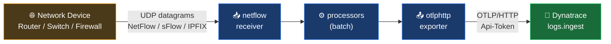

# Ingest NetFlow / sFlow / IPFIX with the OpenTelemetry Collector

A practical guide for receiving network flow telemetry from routers, switches, and firewalls and shipping it to Dynatrace using the OTel Collector's `netflow` receiver.

---

## Table of Contents

1. [How It Works](#how-it-works)
2. [Prerequisites](#prerequisites)
3. [Basic Setup](#basic-setup)
4. [Configuration Reference](#configuration-reference)
5. [Protocol-Specific Setups](#protocol-specific-setups)
   - [NetFlow v5 / v9 / IPFIX](#netflow-v5--v9--ipfix)
   - [sFlow v5](#sflow-v5)
   - [Multi-Protocol (NetFlow + sFlow)](#multi-protocol-netflow--sflow)
6. [Performance Tuning](#performance-tuning)
7. [Deployment Options](#deployment-options)
   - [Linux](#linux)
   - [Docker](#docker)
   - [Kubernetes](#kubernetes)
8. [Querying NetFlow Data in Dynatrace](#querying-netflow-data-in-dynatrace)
9. [Log Record Fields](#log-record-fields)
10. [Tips](#tips)
11. [Troubleshooting](#troubleshooting)
12. [Quick Reference Card](#quick-reference-card)
13. [Further Reading](#further-reading)

---

## How It Works

Network devices (routers, switches, firewalls) export flow summaries — called NetFlow, sFlow, or IPFIX records — describing every TCP/UDP conversation on the wire. The OTel Collector's `netflow` receiver listens for these UDP datagrams, parses each flow into a structured log record, and forwards them to Dynatrace via OTLP.



Each flow record arrives in Dynatrace as a log entry with:
- **Source / Destination** — IP addresses and ports of the conversation
- **Transport** — protocol (`tcp`, `udp`) and IP version (`ipv4`, `ipv6`)
- **Volume** — bytes and packets transferred
- **Timing** — flow start/end timestamps and receive time
- **Flow metadata** — sequence number, sampling rate, TCP flags, sampler address
- **Scope** — `otel.scope.name: otelcol/netflowreceiver` (use this to filter in DQL)

---

## Prerequisites

**Collector distribution** — the `netflow` receiver is not in the core OTel Collector. Use one of:
- **Dynatrace Collector** (recommended — pre-bundled, supported)
- **OTel Collector Contrib** v0.149.0 or later

**API token** with `logs.ingest` scope. Create one in Dynatrace under **Settings → Access tokens**.

**Network device** configured to export flows to the Collector's IP address and UDP port (2055 for NetFlow/IPFIX, 6343 for sFlow by convention).

**Firewall / ACL** — UDP traffic must be permitted from the network device to the Collector on the configured port. Both directions (device → collector host, and at the OS/container level) need to be open.

> **Note:** The `netflow` receiver has **Alpha** stability as of v0.149.0. Configuration may change in future releases without a deprecation period.

---

## Basic Setup

The minimum configuration to receive NetFlow and send records to Dynatrace:

```yaml
receivers:
  netflow:
    hostname: "0.0.0.0"
    scheme: netflow
    port: 2055
    sockets: 2
    workers: 4

processors:
  batch:
    send_batch_size: 30
    timeout: 30s

exporters:
  otlphttp:
    endpoint: ${env:DT_ENDPOINT}
    headers:
      Authorization: "Api-Token ${env:DT_API_TOKEN}"

service:
  pipelines:
    logs:
      receivers: [netflow]
      processors: [batch]
      exporters: [otlphttp]
```

Set these environment variables before starting the Collector:

| Variable | Value |
|----------|-------|
| `DT_ENDPOINT` | `https://{your-env-id}.live.dynatrace.com/api/v2/otlp` |
| `DT_API_TOKEN` | API token with `logs.ingest` scope |

---

## Configuration Reference

All parameters for the `netflow` receiver:

| Parameter | Type | Default | Description |
|-----------|------|---------|-------------|
| `scheme` | string | `netflow` | Flow protocol to expect: `netflow` (covers v5, v9, IPFIX) or `sflow` |
| `hostname` | string | `0.0.0.0` | IP address to bind the listener to. Use `0.0.0.0` to accept on all interfaces |
| `port` | int | `2055` | UDP port to listen on. Convention: 2055 for NetFlow/IPFIX, 6343 for sFlow |
| `sockets` | int | `1` | Number of UDP sockets. Set to number of CPU cores for best throughput |
| `workers` | int | `2` | Decoder threads. Defaults to 2 — Dynatrace docs recommend setting to 2× sockets |
| `queue_size` | int | `1000` | Packet buffer size (minimum 1000). Increase under burst load |
| `send_raw` | bool | `false` | Skip parsing and forward raw flow messages. For debugging only |

---

## Protocol-Specific Setups

### NetFlow v5 / v9 / IPFIX

Use `scheme: netflow` (the default). The receiver auto-detects v5, v9, and IPFIX based on the datagram format — no additional configuration needed.

Limitations:
- Custom field mapping (vendor-specific enterprise fields) is not supported
- Template records for v9/IPFIX must arrive before data records — standard behavior for compliant devices

```yaml
receivers:
  netflow:
    scheme: netflow
    port: 2055
    hostname: "0.0.0.0"
```

**Device-side configuration** (general guidance — varies by vendor):
- Set the NetFlow export destination to the Collector's IP
- Set the destination UDP port to `2055`
- Set the NetFlow version to v9 or IPFIX if possible (richer field set than v5)
- Set the active flow timeout (typically 60s) and inactive flow timeout (typically 15s)

---

### sFlow v5

Use `scheme: sflow` on a separate port. sFlow is a sampling protocol and uses a different datagram format from NetFlow.

```yaml
receivers:
  netflow/sflow:
    scheme: sflow
    port: 6343
    hostname: "0.0.0.0"
```

> **Limitation:** sFlow counter samples are not currently supported and will be silently dropped. Only flow samples are processed.

---

### Multi-Protocol (NetFlow + sFlow)

Run both receivers simultaneously using named instances (`netflow` and `netflow/sflow`). Both feed into the same pipeline:

```yaml
receivers:
  netflow:
    scheme: netflow
    port: 2055
  netflow/sflow:
    scheme: sflow
    port: 6343

processors:
  batch:
    send_batch_size: 30
    timeout: 30s

exporters:
  otlphttp:
    endpoint: ${env:DT_ENDPOINT}
    headers:
      Authorization: "Api-Token ${env:DT_API_TOKEN}"

service:
  pipelines:
    logs:
      receivers: [netflow, netflow/sflow]
      processors: [batch]
      exporters: [otlphttp]
```

---

## Performance Tuning

**Sockets and workers** — the most impactful settings for high-volume environments:

```yaml
receivers:
  netflow:
    scheme: netflow
    port: 2055
    sockets: 8      # set to number of CPU cores
    workers: 16     # set to 2× sockets
```

**Queue size** — if the Collector logs packet drops under bursts, increase the buffer:

```yaml
receivers:
  netflow:
    queue_size: 10000   # default is 1000
```

**Batch processor** — already included in the basic config. The `send_batch_size: 30` / `timeout: 30s` values are recommended by Dynatrace for flow data.

**Horizontal scaling** — for very high-volume environments, distribute flow exports across multiple Collector instances. Configure the network device to send to multiple export targets (if supported) or use a load balancer in front of multiple Collector instances.

---

## Deployment Options

### Linux

```bash
# Set credentials
export DT_ENDPOINT="https://{your-env-id}.live.dynatrace.com/api/v2/otlp"
export DT_API_TOKEN="your-token-here"

# Run the Collector
./otelcol-contrib --config collector.yaml
```

To persist environment variables across restarts, write them to a file and source it, or use a systemd unit with `EnvironmentFile=`.

---

### Docker

```bash
docker run \
  -e DT_ENDPOINT="https://{your-env-id}.live.dynatrace.com/api/v2/otlp" \
  -e DT_API_TOKEN="your-token-here" \
  -p 2055:2055/udp \
  -v $(pwd)/collector.yaml:/etc/otelcol-contrib/config.yaml \
  otel/opentelemetry-collector-contrib:0.149.0
```

> **Critical:** NetFlow and sFlow are **UDP**, not TCP. The Docker `-p` flag must include `/udp` — e.g., `-p 2055:2055/udp`. Without it, Docker maps TCP only and no flow data arrives.

For sFlow add `-p 6343:6343/udp` to the same command.

---

### Kubernetes

For a full Kubernetes deployment pattern, see [otel-demo-kubernetes.md](./otel-demo-kubernetes.md). NetFlow-specific considerations:

**UDP routing** — Kubernetes Services do not load-balance UDP reliably across pods. Deploy the Collector as a single-replica Deployment or DaemonSet and use a NodePort or hostNetwork to expose the UDP port:

```yaml
# Option A — hostNetwork (simplest, binds directly to node port)
spec:
  hostNetwork: true
  containers:
    - name: otelcol
      ports:
        - containerPort: 2055
          protocol: UDP

# Option B — NodePort Service
apiVersion: v1
kind: Service
spec:
  type: NodePort
  ports:
    - port: 2055
      targetPort: 2055
      protocol: UDP
      nodePort: 32055
```

**Config and secrets:**

```yaml
# ConfigMap for collector.yaml
apiVersion: v1
kind: ConfigMap
metadata:
  name: otelcol-netflow-config
data:
  collector.yaml: |
    receivers:
      netflow:
        hostname: "0.0.0.0"
        scheme: netflow
        port: 2055
        sockets: 2
        workers: 4
    processors:
      batch:
        send_batch_size: 30
        timeout: 30s
    exporters:
      otlphttp:
        endpoint: ${env:DT_ENDPOINT}
        headers:
          Authorization: "Api-Token ${env:DT_API_TOKEN}"
    service:
      pipelines:
        logs:
          receivers: [netflow]
          processors: [batch]
          exporters: [otlphttp]
---
# Secret for API token
apiVersion: v1
kind: Secret
metadata:
  name: dt-api-token
type: Opaque
stringData:
  DT_API_TOKEN: "your-token-here"
```

---

## Querying NetFlow Data in Dynatrace

> **Note: All queries below are syntax-validated only — no NetFlow data was available in the test tenant. Field names are sourced from the OTel netflow receiver schema (v0.149.0).**

**Start here — confirm data is arriving:**

```dql
fetch logs
| filter otel.scope.name == "otelcol/netflowreceiver"
| sort timestamp desc
| limit 50
```

**Top talkers by bytes transferred:**

```dql
fetch logs
| filter otel.scope.name == "otelcol/netflowreceiver"
| summarize bytes = sum(flow.io.bytes), by: { source.address }
| sort bytes desc
| limit 20
```

**Traffic by destination port and transport protocol:**

```dql
fetch logs
| filter otel.scope.name == "otelcol/netflowreceiver"
| summarize flows = count(), bytes = sum(flow.io.bytes), by: { destination.port, network.transport }
| sort bytes desc
```

**Conversation pairs — source to destination:**

```dql
fetch logs
| filter otel.scope.name == "otelcol/netflowreceiver"
| summarize bytes = sum(flow.io.bytes), packets = sum(flow.io.packets),
    by: { source.address, destination.address, destination.port }
| sort bytes desc
| limit 50
```

**Flow volume over time by source:**

```dql
timeseries bytes = sum(flow.io.bytes),
    filter: { otel.scope.name == "otelcol/netflowreceiver" },
    by: { source.address }
```

**Filter to a specific host:**

```dql
fetch logs
| filter otel.scope.name == "otelcol/netflowreceiver"
    and (source.address == "10.0.1.50" or destination.address == "10.0.1.50")
| sort timestamp desc
| limit 100
```

---

## Log Record Fields

All attributes emitted by the `netflow` receiver on each log record:

| Field | Type | Description |
|-------|------|-------------|
| `source.address` | string | Source IP address |
| `source.port` | int | Source port number |
| `destination.address` | string | Destination IP address |
| `destination.port` | int | Destination port number |
| `network.transport` | string | Transport protocol: `tcp` or `udp` |
| `network.type` | string | IP version: `ipv4` or `ipv6` |
| `flow.io.bytes` | int | Total bytes in the flow |
| `flow.io.packets` | int | Total packets in the flow |
| `flow.type` | string | Flow format: `netflow_v5`, `netflow_v9`, `ipfix`, `sflow_v5` |
| `flow.sequence_num` | int | Sequence number from the exporting device |
| `flow.start` | timestamp | Flow start time (from device) |
| `flow.end` | timestamp | Flow end time (from device) |
| `flow.sampling_rate` | int | Sampling rate (sFlow / sampled NetFlow) |
| `flow.sampler_address` | string | IP address of the sampling device |
| `flow.tcp_flags` | int | TCP flags bitmask for the flow |
| `flow.time_received` | timestamp | Time the Collector received the datagram |
| `otel.scope.name` | string | Always `otelcol/netflowreceiver` — primary filter field |

**Timestamps:** The log record's observed timestamp is set to the receive time (`flow.time_received`). The record timestamp is set to the flow start time (`flow.start`).

---

## Tips

---

### NetFlow and sFlow are UDP — Docker and K8s port mappings must specify `/udp`

TCP is the default in Docker `-p` flags and Kubernetes Service ports. Without explicitly specifying `/udp`, your ports will be open for TCP only and no flow data will arrive — with no error message.

```bash
# Docker — correct
-p 2055:2055/udp

# Kubernetes Service — correct
ports:
  - port: 2055
    protocol: UDP
```

---

### The receiver is Alpha — expect potential breaking changes

As of v0.149.0, the `netflow` receiver stability is **Alpha**. This means configuration parameters, field names, or behavior may change without a deprecation notice in future Contrib releases. Pin your Collector version if stability matters.

---

### Timestamp behavior: two different times on every record

The record's **observed timestamp** = when the Collector received the UDP packet.
The record's **timestamp** = the flow start time reported by the device.

For long-lived flows (e.g., a 5-minute TCP session), these can differ significantly. Use `flow.start` and `flow.end` for accurate duration calculations:

```dql
fetch logs
| filter otel.scope.name == "otelcol/netflowreceiver"
| fieldsAdd duration_s = (toLong(flow.end) - toLong(flow.start)) / 1000000000
| filter duration_s > 60
| sort duration_s desc
```

---

### sFlow counter samples are silently dropped

The receiver only processes sFlow **flow samples**. sFlow **counter samples** (interface statistics, CPU/memory counters) are received but not converted to log records — they are dropped without any warning or error in the Collector logs.

---

### Verify the collector is reachable from the network device before blaming config

Before debugging the Collector config, confirm the device can actually reach the Collector:
- Run `tcpdump -i any udp port 2055` on the Collector host while the device is exporting — if no packets appear, the issue is network-level (firewall, routing, wrong IP configured on the device)
- Check the device's NetFlow export statistics — most devices show export packet counts and error counters

---

## Troubleshooting

| Symptom | Likely Cause | Fix |
|---------|-------------|-----|
| No logs in Dynatrace at all | Token missing `logs.ingest` scope | Re-create the API token with `logs.ingest` selected |
| No logs in Dynatrace at all | Device not exporting to the correct IP:port | Check device NetFlow export target config; verify with `tcpdump` |
| No logs in Dynatrace at all | UDP port not exposed (Docker/K8s) | Add `/udp` to Docker `-p` flag or set `protocol: UDP` in K8s Service |
| No logs in Dynatrace at all | Wrong Collector distribution | Core OTel Collector does not include the netflow receiver — use Contrib or Dynatrace Collector |
| Records arrive but have no parsed fields | `send_raw: true` is set | Remove `send_raw` or set it to `false` |
| Collector exits on startup | Port already in use | Check if another process is listening on the same UDP port (`ss -ulnp`) |
| Packet drops under high load | Queue exhausted | Increase `queue_size`, increase `sockets` and `workers` |
| sFlow counter data missing | Counter samples not supported | Expected behavior — only flow samples are processed |
| IPFIX records missing fields | Collector received data records before template records | Normal at startup — template records must arrive first; missing fields fill in once templates are cached |

---

## Quick Reference Card

```
┌─────────────────────────────────────────────────────────────────────────────────┐
│              NetFlow / sFlow / IPFIX OTel Receiver — Quick Reference            │
├──────────────────────────┬──────────────────────────────────────────────────────┤
│ Default NetFlow port     │ 2055 (UDP)                                           │
│ Default sFlow port       │ 6343 (UDP)                                           │
│ Supported protocols      │ NetFlow v5, v9, IPFIX, sFlow v5                     │
│ scheme: netflow          │ handles NetFlow v5/v9 and IPFIX                      │
│ scheme: sflow            │ handles sFlow v5 (flow samples only)                 │
├──────────────────────────┼──────────────────────────────────────────────────────┤
│ DT_ENDPOINT              │ https://{env-id}.live.dynatrace.com/api/v2/otlp      │
│ DT_API_TOKEN             │ token with logs.ingest scope                         │
│ Auth header              │ Authorization: Api-Token {token}                     │
├──────────────────────────┼──────────────────────────────────────────────────────┤
│ DQL scope filter         │ otel.scope.name == "otelcol/netflowreceiver"         │
│ Primary volume fields    │ flow.io.bytes, flow.io.packets                       │
│ Primary address fields   │ source.address, destination.address, *.port          │
├──────────────────────────┼──────────────────────────────────────────────────────┤
│ sockets (recommended)    │ = number of CPU cores                                │
│ workers (recommended)    │ = 2 × sockets                                        │
│ queue_size (default)     │ 1000 (increase under burst load)                    │
├──────────────────────────┼──────────────────────────────────────────────────────┤
│ Stability                │ Alpha as of v0.149.0                                 │
│ Distribution             │ OTel Collector Contrib or Dynatrace Collector        │
│ Docker UDP flag          │ -p 2055:2055/udp  (must include /udp)               │
└──────────────────────────┴──────────────────────────────────────────────────────┘
```

---

## Further Reading

- [Dynatrace — NetFlow ingestion with OTel Collector](https://docs.dynatrace.com/docs/ingest-from/opentelemetry/collector/use-cases/netflow)
- [OTel Collector Contrib — netflow receiver (v0.149.0)](https://github.com/open-telemetry/opentelemetry-collector-contrib/tree/v0.149.0/receiver/netflowreceiver)
- [OTel Collector Contrib — Releases](https://github.com/open-telemetry/opentelemetry-collector-contrib/releases)
- [Dynatrace Collector Documentation](https://docs.dynatrace.com/docs/ingest-from/opentelemetry/collector)

---

> **Disclaimer:** This guide is AI-assisted and intended for reference and learning purposes only. It may contain inaccuracies, incomplete information, or content that has drifted from current product behavior — always consult the [official Dynatrace documentation](https://docs.dynatrace.com) for authoritative guidance. This is not an official Dynatrace resource.
