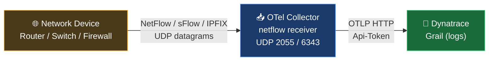

# NetFlow / sFlow / IPFIX → Dynatrace: End-to-End Quickstart

A step-by-step runbook for getting your first flow record into Dynatrace. Each step has an explicit verification check before you move on — when something goes wrong, you'll know exactly which layer to look at.

For deeper reference (tuning, K8s patterns, custom OCB builds, full config options), see [netflow-collector.md](netflow-collector.md).

---

## Table of Contents

1. [What You'll Do](#what-youll-do)
2. [Step 1 — Prerequisites and OTLP endpoint check](#step-1--prerequisites-and-otlp-endpoint-check)
3. [Step 2 — Deploy the OTel Collector](#step-2--deploy-the-otel-collector)
4. [Step 3 — Configure your network device](#step-3--configure-your-network-device)
5. [Step 4 — Verification ladder](#step-4--verification-ladder)
6. [Step 5 — Cleanup and dashboard](#step-5--cleanup-and-dashboard)
7. [Common failure modes](#common-failure-modes)
8. [See also](#see-also)

---

## What You'll Do

1. Confirm prerequisites and **verify your OTLP endpoint with curl**
2. Deploy the OTel Collector via Docker Compose with a `.env` file
3. Configure your network device to export flows
4. Walk the verification ladder: wire → receiver → exporter → tenant
5. Clean up and build a dashboard

Total time on the happy path: ~30 minutes.



---

## Step 1 — Prerequisites and OTLP endpoint check

### 1.1 Generate a Dynatrace API token

In your Dynatrace tenant: **Settings → Access tokens → Generate new token**.

| Setting | Value |
|---|---|
| Required scope | `logs.ingest` (only — principle of least privilege) |
| Save where | Somewhere secure; the token shows once |

### 1.2 Determine your OTLP endpoint

| Tenant type | Endpoint format |
|---|---|
| SaaS (live) | `https://{env-id}.live.dynatrace.com/api/v2/otlp` |
| Managed | `https://{your-domain}/e/{env-id}/api/v2/otlp` |

> The OTLP endpoint host may **not** match the URL in your browser when you're on the platform UI. UI URLs often use a different subdomain (e.g., `.apps.`); the OTLP endpoint uses the **API** subdomain. If you're unsure, the curl check in 1.3 will tell you.

### 1.3 Verify the endpoint with curl before proceeding

This one step prevents the most common cause of "no data in Dynatrace":

```bash
TOKEN="dt0c01.your-token-here"
ENDPOINT="https://{env-id}.live.dynatrace.com/api/v2/otlp"

curl -s -o /dev/null -w "HTTP %{http_code}\n" \
  -X POST \
  -H "Authorization: Api-Token $TOKEN" \
  -H "Content-Type: application/x-protobuf" \
  --data-binary "" \
  "$ENDPOINT/v1/logs"
```

Expected results:

| HTTP code | Meaning | Action |
|---|---|---|
| **200, 202** | Endpoint correct, token valid | ✅ Proceed |
| **400** | Endpoint correct, empty body rejected | ✅ Treat as success — endpoint reachable |
| **401** | Token invalid or missing | Re-check token value |
| **403** | Token missing `logs.ingest` scope | Re-create token with the right scope |
| **404** | Wrong host or path | Try a different subdomain pattern; verify env-id |
| **000** | DNS or TLS failure | Verify hostname spelling and connectivity |

**Do not move past Step 1 until you get 200, 202, or 400.** Every minute spent debugging the device or collector while the endpoint is wrong is wasted time.

---

## Step 2 — Deploy the OTel Collector

We'll use Docker Compose with a `.env` file on a Linux host that has UDP reachability from the network device.

### 2.1 Working directory

```bash
mkdir -p ~/otel-flow && cd ~/otel-flow
```

### 2.2 Create `.env` (mode 600)

```bash
cat > .env <<'EOF'
DT_ENDPOINT=https://{env-id}.live.dynatrace.com/api/v2/otlp
DT_API_TOKEN=dt0c01.your-token-here
EOF
chmod 600 .env
```

Use the **exact** endpoint that returned 200/202/400 in Step 1.3.

### 2.3 Create `config.yaml`

This config listens for both NetFlow/IPFIX (UDP 2055) and sFlow (UDP 6343) simultaneously. Drop the listener you don't need.

```yaml
receivers:
  netflow:
    scheme: netflow
    hostname: 0.0.0.0
    port: 2055
    sockets: 2
    workers: 4
  netflow/sflow:
    scheme: sflow
    hostname: 0.0.0.0
    port: 6343
    sockets: 2
    workers: 4

processors:
  batch:
    send_batch_size: 100
    timeout: 10s

exporters:
  debug:
    verbosity: detailed
  otlp_http/dynatrace:
    endpoint: ${env:DT_ENDPOINT}
    headers:
      Authorization: "Api-Token ${env:DT_API_TOKEN}"

service:
  pipelines:
    logs:
      receivers: [netflow, netflow/sflow]
      processors: [batch]
      exporters: [debug, otlp_http/dynatrace]
```

> The `debug` exporter is intentional — it prints every decoded flow to container logs so you can confirm the receiver is working in Step 4.2. Remove it in Step 5 once data is landing in Grail.

> **Exporter naming:** `otlp_http` is the current alias. Older versions accept `otlphttp` (without underscore) but log a deprecation warning.

### 2.4 Create `docker-compose.yml`

```yaml
services:
  otel-flow:
    image: otel/opentelemetry-collector-contrib:0.151.0
    network_mode: host
    restart: unless-stopped
    env_file: .env
    volumes:
      - ./config.yaml:/etc/otelcol-contrib/config.yaml:ro
    command: ["--config=/etc/otelcol-contrib/config.yaml"]
```

> **Why `network_mode: host`:** UDP doesn't load-balance cleanly through Docker's NAT layer, and host networking sidesteps DNS resolution issues that can plague containers on networks where outbound UDP/53 is restricted. If you must use bridge networking instead, expose the ports explicitly: `-p 2055:2055/udp -p 6343:6343/udp` — the `/udp` suffix is mandatory; without it Docker maps TCP only and no flow data arrives.

> **Pin the version.** Using `:latest` means a future image change can break your deployment silently. The receiver is Alpha-stability and config syntax can shift between releases.

### 2.5 Start the collector

```bash
docker compose up -d
docker compose logs -f
```

Look for the receiver startup lines, then `Ctrl-C` out of the log tail.

### 2.6 Verify the collector is bound

```bash
sudo ss -ulnp | grep -E "2055|6343"
```

You should see `UNCONN` lines for the otelcol process on both ports. If not, the receiver failed to start — check `docker compose logs` for errors and fix before moving on.

---

## Step 3 — Configure your network device

The exact CLI varies by vendor and platform. Configure the device to:

| Setting | Value |
|---|---|
| Export destination IP | The Collector host's IP |
| Export destination UDP port | `2055` for NetFlow/IPFIX, `6343` for sFlow |
| Sample rate | `500`–`1000` for testing (1 in N packets) |
| Polling interval | 30 seconds (sFlow only) |
| Agent / source ID | The device's management IP |
| Interfaces enabled | At least one with active traffic |

Two device-side checks before moving on:

1. **L3 reachability**: from the device CLI, ping the Collector host. If it fails, fix routing/management VRFs/firewall before doing anything else.
2. **Export counter**: most platforms have a "show flow" / "show sflow collector" command that shows datagrams sent. The counter should be incrementing.

> Vendor docs are authoritative for syntax. Common starting points: Junos `set protocols sflow ...` or `set forwarding-options sampling ...`; Cisco IOS-XE `flow exporter` + `flow monitor` + interface-level `ip flow monitor`; Arista `sflow run` / `sflow source ...`. Parameters above always apply regardless of vendor.

---

## Step 4 — Verification ladder

Walk these checks in order. Each one tests a single layer. **Stop at the first failure and fix that layer before moving on** — debugging the wrong layer is the second-most-common time sink (after wrong OTLP endpoint).

### 4.1 Are flow datagrams arriving on the wire?

Find your LAN-facing interface (`ip -br link`), then run tcpdump against that specific interface:

```bash
sudo tcpdump -ni <iface> 'udp port 2055 or udp port 6343' -c 10
```

> **Don't use `-i any` on newer Ubuntu/Debian kernels.** The default LINUX_SLL2 DLT may not be supported and tcpdump exits with `LINUX_SLL2 is not one of the DLTs supported by this device`. Use a specific interface — it's faster anyway.

| Result | Meaning | Action |
|---|---|---|
| Packets shown | ✅ Wire is good | Proceed to 4.2 |
| Nothing in 30s | Network path issue | Re-check device export config, host firewall, network ACLs, routing |

### 4.2 Is the receiver decoding flows?

```bash
docker compose logs --since=1m otel-flow | grep flow.type
```

| Result | Meaning | Action |
|---|---|---|
| Lines with `flow.type: sflow_5` / `netflow_v9` / `ipfix` etc. | ✅ Receiver decoding | Proceed to 4.3 |
| tcpdump showed packets but no decoded flows | Port/scheme mismatch | Confirm device exports match the receiver's `scheme` and `port` |

### 4.3 Is the OTLP exporter shipping successfully?

```bash
docker compose logs --since=1m otel-flow \
  | grep -iE "exporting failed|partial_success|error.*otlp"
```

| Result | Meaning | Action |
|---|---|---|
| No matching lines | ✅ Exports succeeding | Proceed to 4.4 |
| `HTTP Status Code 404` | Wrong OTLP URL | Re-do Step 1.3 with curl, fix `.env`, then **`docker compose down && docker compose up -d`** |
| `HTTP Status Code 401` | Token invalid | Re-check token in `.env` |
| `HTTP Status Code 403` | Token lacks `logs.ingest` scope | Re-create token with that scope |
| Connection timeout | Outbound HTTPS to Dynatrace blocked | Check egress firewall / proxy |

> **Critical gotcha:** `docker compose restart` does **not** re-read `.env`. After any change to `.env`, you must `docker compose down && docker compose up -d` to fully recreate the container with the new environment. A `restart` keeps the old environment variables baked in from container creation time.

### 4.4 Is the data in Grail?

Run this DQL in the same tenant the token belongs to:

```dql
fetch logs, from: now() - 5m
| filter otel.scope.name == "otelcol/netflowreceiver"
| limit 50
```

| Result | Meaning | Action |
|---|---|---|
| Rows returned with `flow.*` fields | ✅ Pipeline complete | Move to Step 5 |
| 0 rows but no errors above | Wait 60s and retry; verify token tenant matches DQL tenant | If still empty, double-check `DT_ENDPOINT` env-id matches the tenant you're querying |

---

## Step 5 — Cleanup and dashboard

### 5.1 Remove the debug exporter

Once data is flowing, edit `config.yaml`:
- Delete the `debug:` block under `exporters:`
- Remove `debug` from the `exporters:` list under `service.pipelines.logs`

Then recreate the container:
```bash
docker compose down && docker compose up -d
```

This stops the verbose flow-record logging in container output. The OTLP pipeline keeps running.

### 5.2 Three starter DQL queries

**Top talkers by bytes (last hour):**
```dql
fetch logs, from: now() - 1h
| filter otel.scope.name == "otelcol/netflowreceiver"
| summarize totalBytes = sum(toLong(flow.io.bytes))
  by: { source.address }
| sort totalBytes desc
| limit 20
```

**Top conversations:**
```dql
fetch logs, from: now() - 1h
| filter otel.scope.name == "otelcol/netflowreceiver"
| summarize totalBytes = sum(toLong(flow.io.bytes)),
            totalPackets = sum(toLong(flow.io.packets))
  by: { source.address, destination.address, destination.port }
| sort totalBytes desc
| limit 50
```

**Protocol mix:**
```dql
fetch logs, from: now() - 1h
| filter otel.scope.name == "otelcol/netflowreceiver"
| summarize totalBytes = sum(toLong(flow.io.bytes))
  by: { network.transport }
```

### 5.3 Optional — derive metrics from logs

The `netflow` receiver emits **logs only**. For dashboards or alerts that benefit from low-cardinality, retained metrics, configure log-derived metrics in **Settings → Log Monitoring → Metrics extracted from logs**. Recommended starter metrics:

| Metric | Source field | Useful dimensions |
|---|---|---|
| `flow.bytes_total` | `flow.io.bytes` | `source.address`, `destination.address`, `network.transport` |
| `flow.packets_total` | `flow.io.packets` | same as above |

Keep dimension cardinality reasonable — IP-pair dimensions can explode quickly on chatty networks.

---

## Common failure modes

A condensed cheat sheet of the most-likely failures and the single fix for each.

| Symptom | Root cause | Fix |
|---|---|---|
| HTTP 404 from OTLP exporter | Used a UI/platform URL instead of the API URL | Re-run Step 1.3 with curl to find the right host |
| Edited `.env`, no change in behavior | `docker compose restart` doesn't reload env files | `docker compose down && docker compose up -d` |
| `tcpdump -i any` errors out | Kernel/libpcap LINUX_SLL2 incompatibility | Use a specific interface name |
| Receiver listens but no decoded flows | Device sending to a port that doesn't match the receiver's `scheme` | Match `scheme` + `port` to the device's actual export |
| 0 rows in Grail despite 200 OTLP responses | Token belongs to a different tenant than you're querying | Compare env-id in `DT_ENDPOINT` to the tenant URL |
| Docker port mapping silently broken | `-p 2055:2055` (no `/udp`) maps TCP only | Always use `-p 2055:2055/udp` for UDP |
| Receiver exits on startup with "address in use" | Another process owns the port | `sudo ss -ulnp | grep 2055` and stop the conflict |
| sFlow counter samples not appearing | Receiver only processes flow samples; counter samples are silently dropped | Expected — known limitation in current receiver |

---

## See also

- [netflow-collector.md](netflow-collector.md) — full reference (config options, Kubernetes patterns, custom OCB builds, performance tuning, all log record fields)
- [Dynatrace — NetFlow ingestion with OTel Collector](https://docs.dynatrace.com/docs/ingest-from/opentelemetry/collector/use-cases/netflow)
- [OTel Collector Contrib — netflow receiver README](https://github.com/open-telemetry/opentelemetry-collector-contrib/tree/main/receiver/netflowreceiver)

---

> **Disclaimer:** This guide is AI-assisted and intended for reference and learning purposes only. It may contain inaccuracies, incomplete information, or content that has drifted from current product behavior — always consult the [official Dynatrace documentation](https://docs.dynatrace.com) for authoritative guidance. This is not an official Dynatrace resource.
