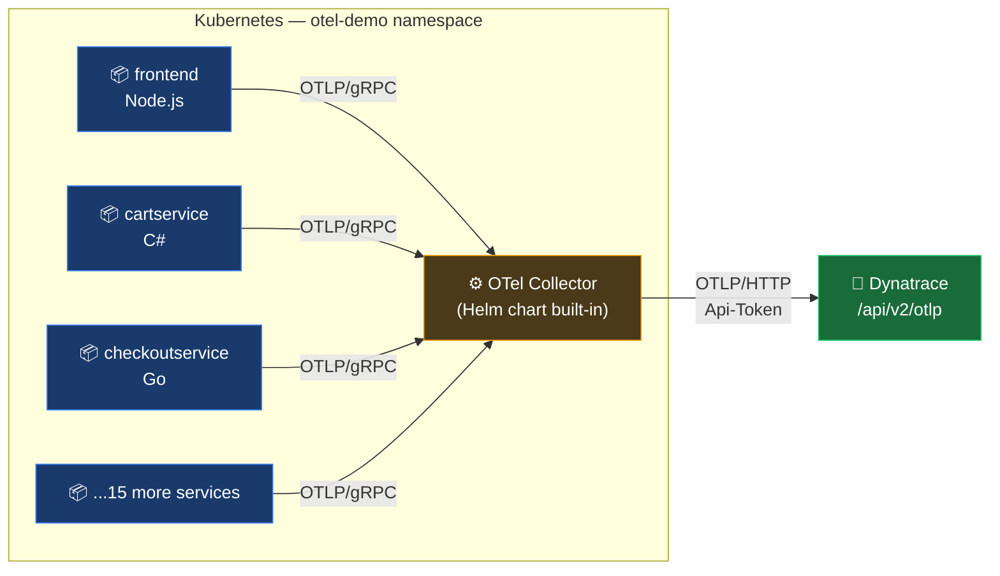

# OpenTelemetry Demo on Kubernetes with Dynatrace

Deploy the OpenTelemetry Demo app to a Kubernetes cluster and send all telemetry — traces, metrics, and logs — to Dynatrace using the Helm chart's built-in collector.

---

## Table of Contents

1. [What is the OpenTelemetry Demo?](#what-is-the-opentelemetry-demo)
2. [Architecture](#architecture)
3. [Prerequisites](#prerequisites)
4. [Dynatrace API Token](#dynatrace-api-token)
5. [Setup Steps](#setup-steps)
   - [1. Add the Helm Repository](#1-add-the-helm-repository)
   - [2. Create the Namespace](#2-create-the-namespace)
   - [3. Create the Token Secret](#3-create-the-token-secret)
   - [4. Create values.yaml](#4-create-valuesyaml)
   - [5. Install the Chart](#5-install-the-chart)
6. [values.yaml Reference](#valuesyaml-reference)
7. [Verify Data in Dynatrace](#verify-data-in-dynatrace)
8. [Tips](#tips)
9. [Quick Reference Card](#quick-reference-card)
10. [Further Reading](#further-reading)

---

## What is the OpenTelemetry Demo?

The [OpenTelemetry Demo](https://opentelemetry.io/docs/demo/) is a microservices reference application maintained by the OpenTelemetry community. It ships with ~20 services written in different languages (Go, Java, Python, Node.js, .NET, Ruby, PHP, Rust), all pre-instrumented with the OTel SDK. It is the fastest way to generate real, realistic traces, metrics, and logs without writing any instrumentation yourself.

The Helm chart bundles the demo services alongside an OpenTelemetry Collector, Grafana, and Prometheus. This guide disables Grafana and Prometheus and routes all telemetry to Dynatrace instead.

---

## Architecture



Services export to the in-cluster Collector over gRPC (no token needed from each service). The Collector handles auth and forwards everything to Dynatrace over OTLP/HTTP.

---

## Prerequisites

- `kubectl` configured against your cluster
- `helm` v3+
- A Dynatrace environment (SaaS or Managed)
- API token with the scopes listed below

---

## Dynatrace API Token

Create a token at **Settings > Access Tokens > Generate new token** with these scopes:

| Signal | Required Scope |
|--------|---------------|
| Traces | `openTelemetryTrace.ingest` |
| Metrics | `metrics.ingest` |
| Logs | `logs.ingest` |

All three scopes can be on a single token.

---

## Setup Steps

### 1. Add the Helm Repository

```bash
helm repo add open-telemetry https://open-telemetry.github.io/opentelemetry-helm-charts
helm repo update
```

---

### 2. Create the Namespace

```bash
kubectl create namespace otel-demo
```

---

### 3. Create the Token Secret

```bash
kubectl create secret generic dynatrace-otel-secret \
  --from-literal=DT_API_TOKEN=<your-api-token> \
  -n otel-demo
```

Replace `<your-api-token>` with your actual token. The secret name and key are referenced by the collector config in `values.yaml`.

---

### 4. Create values.yaml

Create a `values.yaml` file with the configuration below. Replace `{environment-id}` with your Dynatrace environment ID.

```yaml
grafana:
  enabled: false

prometheus:
  enabled: false

components:
  accounting:
    enabled: false
  payment:
    enabled: false

opentelemetry-collector:
  enabled: true

  extraEnvs:
    - name: DT_API_TOKEN
      valueFrom:
        secretKeyRef:
          name: dynatrace-otel-secret
          key: DT_API_TOKEN

  config:
    receivers:
      otlp:
        protocols:
          grpc: {}
          http: {}

    processors:
      batch: {}

    exporters:
      otlphttp/dynatrace:
        endpoint: https://{environment-id}.live.dynatrace.com/api/v2/otlp
        headers:
          Authorization: "Api-Token ${DT_API_TOKEN}"

    service:
      pipelines:
        traces:
          receivers: [otlp]
          processors: [batch]
          exporters: [otlphttp/dynatrace]
        metrics:
          receivers: [otlp]
          processors: [batch]
          exporters: [otlphttp/dynatrace]
        logs:
          receivers: [otlp]
          processors: [batch]
          exporters: [otlphttp/dynatrace]
```

> **Endpoint format:** For SaaS, use `https://{environment-id}.live.dynatrace.com/api/v2/otlp`. For Managed via ActiveGate, use `https://{activegate-domain}:9999/e/{environment-id}/api/v2/otlp`.

---

### 5. Install the Chart

```bash
helm install my-otel-demo open-telemetry/opentelemetry-demo \
  -n otel-demo \
  -f values.yaml
```

Verify pods are running:

```bash
kubectl get pods -n otel-demo
```

All pods should reach `Running` status within a few minutes. The demo includes a load generator that produces continuous traffic automatically.

---

## values.yaml Reference

| Key | What it does |
|-----|-------------|
| `grafana.enabled: false` | Skips Grafana — Dynatrace is the visualization backend |
| `prometheus.enabled: false` | Skips Prometheus — Dynatrace ingests metrics directly |
| `components.accounting.enabled: false` | Disables the accounting service (optional, reduces pod count) |
| `components.payment.enabled: false` | Disables the payment service (optional, reduces pod count) |
| `opentelemetry-collector.extraEnvs` | Injects `DT_API_TOKEN` from the Kubernetes secret into the Collector pod |
| `otlphttp/dynatrace` | Named exporter instance — `/dynatrace` suffix lets you distinguish exporters in multi-backend configs |
| `Authorization: "Api-Token ${DT_API_TOKEN}"` | Dynatrace API token auth — `${DT_API_TOKEN}` is resolved from the injected env var at runtime |

---

## Verify Data in Dynatrace

After installation, the built-in load generator starts sending traffic within ~30 seconds.

**Check traces:**
1. Go to **Distributed Tracing** (or **Services** in Dynatrace)
2. Filter by service name — look for `frontend`, `cartservice`, `checkoutservice`, etc.
3. You should see spans within 1–2 minutes of the pods becoming ready

**Check metrics:**
- Open **Metrics Explorer** and search for `rpc.` or `http.` — demo services emit standard OTel semantic convention metrics

**Check logs:**
- Open **Logs** and filter by `k8s.namespace.name = otel-demo`

**If no data appears:**
- Check Collector pod logs: `kubectl logs -n otel-demo -l app.kubernetes.io/component=opentelemetry-collector`
- Look for `401 Unauthorized` (wrong token or scopes) or connection errors to your endpoint
- Confirm the endpoint URL uses the correct format (`.live.dynatrace.com`, not `.apps.dynatrace.com`)

---

## Tips

---

### The Collector log is your first debug stop

If data isn't reaching Dynatrace, the Collector will tell you why:

```bash
kubectl logs -n otel-demo \
  $(kubectl get pod -n otel-demo -l app.kubernetes.io/component=opentelemetry-collector -o name)
```

A `401` response means the token is wrong or missing a scope. A connection refused means the endpoint URL is incorrect.

---

### The load generator runs automatically

The demo chart includes a `loadgenerator` service that fires synthetic traffic continuously. You do not need to manually trigger requests — data should flow to Dynatrace on its own once pods are ready.

---

### Disabled components still affect other services

`accounting` and `payment` are disabled in this guide to reduce resource usage. If you see error spans in checkout flows, it may be because a downstream service they depend on is missing. Re-enable them if you need complete end-to-end traces.

---

### The token is injected as an env var — not baked into the chart

`${DT_API_TOKEN}` in `values.yaml` is resolved by the Collector process at runtime from the environment variable injected via `extraEnvs`. It is never stored in the Helm release manifest. Rotate the secret with `kubectl create secret ... --dry-run -o yaml | kubectl apply -f -` and restart the Collector pod.

---

### Upgrading the chart preserves your values.yaml

```bash
helm upgrade my-otel-demo open-telemetry/opentelemetry-demo \
  -n otel-demo \
  -f values.yaml
```

Run `helm repo update` first to pull the latest chart version.

---

## Quick Reference Card

```
┌────────────────────────────────────────────────────────────────────────┐
│           OTel Demo on Kubernetes + Dynatrace — Quick Reference        │
├────────────────────────┬───────────────────────────────────────────────┤
│ Helm repo              │ open-telemetry/opentelemetry-helm-charts       │
│ Chart name             │ open-telemetry/opentelemetry-demo              │
├────────────────────────┼───────────────────────────────────────────────┤
│ Token scopes needed    │ openTelemetryTrace.ingest                      │
│                        │ metrics.ingest                                 │
│                        │ logs.ingest                                    │
├────────────────────────┼───────────────────────────────────────────────┤
│ DT endpoint (SaaS)     │ https://{env-id}.live.dynatrace.com/api/v2/otlp│
│ DT endpoint (Managed)  │ https://{ag}:9999/e/{env-id}/api/v2/otlp      │
├────────────────────────┼───────────────────────────────────────────────┤
│ Create secret          │ kubectl create secret generic                  │
│                        │   dynatrace-otel-secret                        │
│                        │   --from-literal=DT_API_TOKEN=<token>          │
│                        │   -n otel-demo                                 │
├────────────────────────┼───────────────────────────────────────────────┤
│ Install                │ helm install my-otel-demo                      │
│                        │   open-telemetry/opentelemetry-demo            │
│                        │   -n otel-demo -f values.yaml                  │
│ Upgrade                │ helm upgrade my-otel-demo ...  (same flags)    │
│ Uninstall              │ helm uninstall my-otel-demo -n otel-demo       │
├────────────────────────┼───────────────────────────────────────────────┤
│ Debug collector        │ kubectl logs -n otel-demo                      │
│                        │   -l app.kubernetes.io/component=              │
│                        │      opentelemetry-collector                   │
└────────────────────────┴───────────────────────────────────────────────┘
```

---

## Further Reading

- [OpenTelemetry Demo — Official Docs](https://opentelemetry.io/docs/demo/)
- [opentelemetry-demo Helm Chart](https://github.com/open-telemetry/opentelemetry-helm-charts/tree/main/charts/opentelemetry-demo)
- [Dynatrace OTLP Ingestion Reference](https://docs.dynatrace.com/docs/ingest-from/opentelemetry/otlp-api)
- [OpenTelemetry Collector Helm Chart](https://github.com/open-telemetry/opentelemetry-helm-charts/tree/main/charts/opentelemetry-collector)

---

> **Disclaimer:** This guide is AI-assisted and intended for reference and learning purposes only. It may contain inaccuracies, incomplete information, or content that has drifted from current product behavior — always consult the [official Dynatrace documentation](https://docs.dynatrace.com) for authoritative guidance. This is not an official Dynatrace resource.
